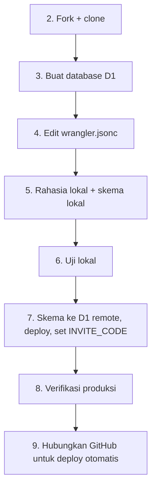

# Panduan Deployment untuk Fork SMCL

Dokumen ini untuk Anda yang ingin menjalankan **instance pribadi** SMCL dari fork repositori ini, mulai dari
fork di GitHub, konfigurasi `wrangler.jsonc`, sampai pengaturan di dashboard Cloudflare.
Estimasi waktu: 30-60 menit untuk pertama kali.

Setelah selesai, Anda akan memiliki:

- Aplikasi SMCL di alamat `https://<nama-worker>.<subdomain-anda>.workers.dev`
- Database D1 **milik akun Cloudflare Anda sendiri** (tidak ada data yang melewati atau dibagi ke pemilik repositori asli)
- Kode organisasi (`INVITE_CODE`) buatan Anda sendiri yang mengontrol siapa yang boleh mendaftar
- Deploy otomatis setiap Anda mendorong perubahan ke GitHub

> **Baca dulu: tiga hal yang paling sering menjebak**
>
> 1. **Setiap fork adalah instance terpisah.** Database, rahasia, dan pengguna Anda sendiri. Anda **tidak boleh** memakai
>    `database_id` milik repositori asli (tidak akan bisa diakses, dan akan menyebabkan error). Anda membuat database sendiri di langkah 3.
> 2. **Paket Cloudflare Workers Free memiliki batas 10 ms waktu CPU per permintaan.** Hash password di server
>    (PBKDF2 100.000 iterasi) berpotensi melewatinya, sehingga **login dan daftar bisa gagal dengan Error 1102**.
>    Kalau itu terjadi, solusinya adalah paket Workers Paid (sekitar $5/bulan, cek harga terkini). Lihat [bagian 13](#13-batas-paket-dan-biaya).
> 3. **Proyek ini belum diaudit pihak ketiga.** Baca `README.md` bagian 2 (Model Keamanan) dan bagian 13 (Batasan Teknis)
>    sebelum menyimpan data yang benar-benar sensitif.

## Daftar Isi

0. [Gambaran alur](#0-gambaran-alur)
1. [Prasyarat](#1-prasyarat)
2. [Fork dan clone](#2-fork-dan-clone)
3. [Buat database D1](#3-buat-database-d1)
4. [Konfigurasi `wrangler.jsonc`](#4-konfigurasi-wranglerjsonc)
5. [Rahasia lokal dan skema lokal](#5-rahasia-lokal-dan-skema-lokal)
6. [Jalankan dan uji secara lokal](#6-jalankan-dan-uji-secara-lokal)
7. [Deploy pertama (manual)](#7-deploy-pertama-manual)
8. [Verifikasi produksi](#8-verifikasi-produksi)
9. [Deploy otomatis dari GitHub](#9-deploy-otomatis-dari-github)
10. [Peta dashboard Cloudflare](#10-peta-dashboard-cloudflare)
11. [Keamanan untuk instance pribadi](#11-keamanan-untuk-instance-pribadi)
12. [Memperbarui fork dari repositori asli](#12-memperbarui-fork-dari-repositori-asli)
13. [Batas paket dan biaya](#13-batas-paket-dan-biaya)
14. [Pemecahan masalah](#14-pemecahan-masalah)
15. [Menghapus instance](#15-menghapus-instance)
16. [Daftar periksa akhir](#16-daftar-periksa-akhir)

---

## 0. Gambaran alur



Hal yang **tidak** ikut otomatis walaupun Anda memakai deploy dari GitHub: skema database (dijalankan manual ke D1)
dan rahasia (`INVITE_CODE`, diisi manual di Cloudflare).

---

## 1. Prasyarat

| Kebutuhan | Keterangan | Cek |
| :--- | :--- | :--- |
| Akun GitHub | Untuk fork repositori | - |
| Akun Cloudflare | Paket gratis cukup untuk memulai | [dash.cloudflare.com](https://dash.cloudflare.com) |
| Node.js (LTS terbaru) dan npm | Astro 6 mensyaratkan Node yang baru. Jika repositori memiliki berkas `.nvmrc`, pakai versi itu | `node -v`, `npm -v` |
| Git | - | `git --version` |
| Peramban modern | Web Crypto butuh `localhost` atau HTTPS | - |
| (Opsional) Domain sendiri | Untuk alamat kustom dan aturan WAF | - |

Aktifkan **autentikasi dua faktor (2FA)** di akun GitHub dan Cloudflare sekarang, sebelum lanjut. Akun yang memegang
deploy adalah jalur kepercayaan aplikasi ini (lihat [bagian 11](#11-keamanan-untuk-instance-pribadi)).

---

## 2. Fork dan clone

### 2.1 Fork di GitHub

1. Buka halaman repositori asli di GitHub, lalu klik **Fork** (kanan atas).
2. Pilih akun Anda sebagai pemilik, beri nama repositori (misalnya tetap `smcl`), lalu **Create fork**.

> Fork dari repositori publik akan berstatus **publik**. Itu aman selama Anda tidak pernah mengomit rahasia
> (`.dev.vars`, token, kode organisasi). Kalau Anda ingin repositori **privat**, lihat 2.2.

### 2.2 (Opsional) Repositori privat

GitHub tidak mengizinkan fork publik dijadikan privat. Sebagai gantinya, buat repositori privat kosong di akun Anda,
lalu:

```bash
git clone https://github.com/<pemilik-asli>/<repo-asli>.git smcl
cd smcl
git remote rename origin upstream
git remote add origin https://github.com/<akun-anda>/<repo-privat>.git
git push -u origin main
```

Lanjut ke langkah 2.4 (Anda sudah punya `upstream`, jadi 2.3 bisa dilewati).

### 2.3 Clone fork Anda

```bash
git clone https://github.com/<akun-anda>/<nama-repo>.git smcl
cd smcl
```

### 2.4 Daftarkan repositori asli sebagai `upstream`

Ini membuat Anda bisa menarik pembaruan nanti ([bagian 12](#12-memperbarui-fork-dari-repositori-asli)).

```bash
git remote add upstream https://github.com/<pemilik-asli>/<repo-asli>.git
git remote -v        # origin = fork Anda, upstream = repositori asli
```

### 2.5 Pasang dependensi

```bash
npm install
```

---

## 3. Buat database D1

```bash
npx wrangler login            # membuka browser untuk otorisasi
npx wrangler whoami           # pastikan akun yang benar
npx wrangler d1 create smcl-db --location=apac
```

- `--location` hanya **petunjuk** lokasi database utama. Pilihan: `weur`, `eeur`, `apac` (Asia-Pasifik), `oc` (Oseania),
  `wnam`, `enam`. Hasilnya tidak dijamin persis di lokasi itu. Tanpa opsi ini, D1 memilih lokasi yang dekat dengan tempat Anda
  menjalankan perintah.
- **Catat `database_id`** (berupa UUID) dari output.
- Wrangler mungkin menawarkan untuk menambahkan binding ke `wrangler.jsonc` secara otomatis dan menamainya
  `smcl_db`. **Nama itu salah untuk proyek ini**; kode memanggil `env.DB`. Tolak tawarannya atau perbaiki namanya di langkah 4.

---

## 4. Konfigurasi `wrangler.jsonc`

> Nama berkasnya **`wrangler.jsonc`** (tanpa titik di depan). Folder **`.wrangler/`** (dengan titik) berbeda: itu tempat
> Wrangler menyimpan state lokal dan tidak boleh dikomit.

Buka `wrangler.jsonc` di root proyek. Jangan menghapus bagian bawaan (`main`, `assets`, `compatibility_flags`, dll.).
Yang perlu Anda sesuaikan hanya yang ditandai:

```jsonc
{
  "$schema": "./node_modules/wrangler/config-schema.json",
  "compatibility_date": "2026-09-26",
  "compatibility_flags": ["global_fetch_strictly_public"],
  "name": "smcl",                                   // (1) nama Worker Anda
  "main": "@astrojs/cloudflare/entrypoints/server",
  "assets": { "directory": "./dist", "binding": "ASSETS" },
  "observability": { "enabled": true },
  "d1_databases": [
    {
      "binding": "DB",                              // (2) harus persis "DB"
      "database_name": "smcl-db",                   // (3) sama dengan langkah 3
      "database_id": "ISI-DENGAN-ID-DARI-LANGKAH-3" // (4) ID database Anda
    }
  ]
}
```

| # | Bagian | Aturan |
| :--- | :--- | :--- |
| 1 | `name` | Nama Worker di akun Anda; juga menjadi bagian URL `workers.dev`. Jika nanti memakai deploy GitHub, nama ini **harus sama persis** dengan nama Worker di dashboard |
| 2 | `binding` | **Harus `DB`** (huruf besar semua). Kode memanggil `env.DB`. Nama lain menyebabkan error `Cannot read properties of undefined (reading 'prepare')` |
| 3 | `database_name` | Nama database dari langkah 3 |
| 4 | `database_id` | UUID dari langkah 3. Ini bukan rahasia (aman dikomit), tetapi **harus milik database Anda** |

Hal lain yang perlu dipastikan:

- **Tidak ada `"remote": true`** di dalam blok D1. Opsi itu membuat mode dev memakai database produksi.
- Nilai `compatibility_date` bawaan boleh dibiarkan.
- Dalam repositori asli, `database_id` mungkin milik pemilik asli atau sebuah placeholder. Apa pun isinya, **timpa dengan ID Anda**.

---

## 5. Rahasia lokal dan skema lokal

### 5.1 Buat kode organisasi

Kode ini adalah satu-satunya penjaga pendaftaran. Buat yang panjang dan acak:

```bash
node -e "console.log(require('crypto').randomBytes(24).toString('base64url'))"
```

Disclaimer: Sebenarnya tidak apa-apa membuat kode organisasi tanpa kriptografi panjang, boleh saja nama yang intuitif tapi sulit di tebak, contoh "IniVerifikasiDaftarAkunSmcl". Karena kode kriptografi tersebut disarankan jika ingin punya keamanan yang sangat kokoh (kebal bruteforce).

### 5.2 Buat `.dev.vars`

Buat berkas `.dev.vars` di root proyek (sejajar dengan `package.json`) dengan isi:

```text
INVITE_CODE=tempel-kode-acak-dari-langkah-5-1
```

Disclaimer: variabel ini hanya berjalan untuk pengujian di localhost saja, bukan deployment, jadi sifatnya **Opsional**

> **Windows PowerShell:** perintah `echo ... > .dev.vars` pada Windows PowerShell versi lama menulis berkas dalam
> encoding UTF-16, yang membuat Wrangler gagal membacanya. Buat berkas ini dengan editor teks (simpan sebagai UTF-8),
> atau pakai `Set-Content -Path .dev.vars -Value "INVITE_CODE=..." -Encoding utf8`.

Pastikan `.dev.vars` ada di `.gitignore` (juga `.wrangler/`, `dist/`, `node_modules/`). Cek:

```bash
git check-ignore -v .dev.vars
```

### 5.3 Buat tipe dan tabel lokal

```bash
npx wrangler types
npx wrangler d1 execute smcl-db --local --file=schema.sql
```

Tabel lokal disimpan di folder `.wrangler/state` dan **tidak** menyentuh database di Cloudflare. Verifikasi:

```bash
npx wrangler d1 execute smcl-db --local --command "SELECT name FROM sqlite_master WHERE type='table' ORDER BY name"
```

Harus muncul `auth_attempts`, `messages`, `sessions`, `users`, dan `vault_items`.

---

## 6. Jalankan dan uji secara lokal

```bash
npm run dev
```

Buka `http://localhost:4321`, lalu:

1. Daftar dengan kode organisasi dari `.dev.vars`.
2. Buat passphrase brankas (minimal 12 karakter, **berbeda** dari password login).
3. Tambah satu link dan satu catatan, reload halaman, buka kembali brankas.

Lalu uji hasil build produksi di runtime Workers lokal (CSP dan header berperilaku sedikit berbeda dari mode dev):

```bash
npx astro build
npx wrangler dev
```

Buka alamat yang dicetak (biasanya `http://localhost:8787`) dan ulangi uji di atas. Kalau uji lokal gagal, perbaiki
di sini dulu sebelum menyentuh Cloudflare. Lihat [bagian 14](#14-pemecahan-masalah).

Reset database lokal kapan saja:

```bash
# hentikan server dulu (Ctrl+C)
rm -rf .wrangler/state            # Windows PowerShell: Remove-Item -Recurse -Force .wrangler\state
npx wrangler d1 execute smcl-db --local --file=schema.sql
```

---

## 7. Deploy pertama (manual)

Deploy pertama dilakukan manual supaya Worker terbentuk dan Anda bisa memverifikasi D1 remote langkah demi langkah.
Otomatisasi GitHub dipasang setelahnya ([bagian 9](#9-deploy-otomatis-dari-github)).

### 7.1 Kirim skema ke D1 remote

```bash
npx wrangler d1 execute smcl-db --remote --file=schema.sql
npx wrangler d1 execute smcl-db --remote --command "SELECT name FROM sqlite_master WHERE type='table' ORDER BY name"
npx wrangler d1 execute smcl-db --remote --command "PRAGMA table_info(users)"
```

**Titik periksa:** lima tabel di atas ada (tabel internal berawalan `_cf_` boleh diabaikan), dan kolom `users` memuat
`vault_check`, `public_key`, dan `wrapped_private_key`.

### 7.2 Build dan deploy

```bash
npx astro build
npx wrangler deploy
```

- Wrangler mungkin meminta Anda memilih **subdomain `workers.dev`** pada deploy pertama. Nama itu menjadi bagian URL.
- Di akhir, Wrangler mencetak URL aplikasi: `https://smcl.<subdomain-anda>.workers.dev`.
- Kalau Wrangler menyebut binding KV bernama `SESSION`, itu penyimpanan sesi bawaan adapter Astro yang tidak dipakai
  aplikasi ini (aplikasi memakai tabel `sessions` di D1). Abaikan, kecuali ia menyebabkan error.

### 7.3 Isi kode organisasi produksi

```bash
npx wrangler secret put INVITE_CODE
```

Tempel kode organisasi. Saran: **buat kode baru** yang berbeda dari kode lokal. Sebelum secret diisi, semua
pendaftaran ditolak (gagal tertutup), dan itu perilaku yang benar.

---

## 8. Verifikasi produksi

Buka dua terminal. Di terminal kedua, pantau log langsung:

```bash
npx wrangler tail --format pretty
```

Lalu uji berurutan:

| # | Aksi | Hasil yang benar |
| :--- | :--- | :--- |
| 1 | Buka URL aplikasi | Halaman login tampil dengan benar |
| 2 | Buka `/links` di jendela incognito | Dialihkan ke `/login` |
| 3 | `curl -i https://<url-anda>/api/me` | `401 Unauthorized` dengan header `x-frame-options` |
| 4 | Daftar dengan kode **salah** | "Kode organisasi tidak valid." |
| 5 | Daftar dengan kode **benar** | Masuk ke `/links`. Jika muncul Error 1102, lihat [bagian 13](#13-batas-paket-dan-biaya) |
| 6 | Buat passphrase, tambah link dan catatan, reload, buka lagi | Data terbaca |
| 7 | Buka Console browser | Tidak ada pesan `Refused to ...` dari CSP |

Buktikan D1 remote dipakai dan datanya terenkripsi:

```bash
npx wrangler d1 execute smcl-db --remote --command "SELECT username, created_at FROM users"
npx wrangler d1 execute smcl-db --remote --command "SELECT type, substr(encrypted_payload,1,60) AS payload FROM vault_items"
```

Akun yang baru Anda daftarkan harus muncul, dan isi `vault_items` harus berupa string acak tanpa judul atau URL yang
terbaca. Uji dua akun dan chat dengan peramban kedua. Uji keamanan yang lebih lengkap ada di `README.md` bagian 9.

---

## 9. Deploy otomatis dari GitHub

Cloudflare menyediakan **Workers Builds**: setiap push ke branch produksi menjalankan build, lalu perintah deploy.
Karena Worker Anda sudah ada dari langkah 7, Anda tinggal menyambungkannya ke repositori.

### 9.1 Siapkan repositori

- `wrangler.jsonc` terkomit dengan `name`, `binding`, dan `database_id` yang benar.
- `package-lock.json` terkomit.
- Berkas `.nvmrc` berisi versi mayor Node yang Anda pakai (hasil `node -v`), karena build image Cloudflare bisa memakai
  versi yang lebih lama.
- Pastikan tidak ada berkas rahasia yang terlacak Git:
  ```bash
  git ls-files | grep -E "dev.vars|\.wrangler|dump.sql"       # hasil harus kosong
  ```
  ```powershell
  git ls-files | Select-String "dev.vars|\.wrangler|dump.sql"  # Windows PowerShell
  ```
  Jika `.dev.vars` pernah terkomit, anggap `INVITE_CODE` bocor dan ganti dengan `npx wrangler secret put INVITE_CODE`.

### 9.2 Sambungkan di dashboard

Nama menu bisa sedikit berbeda dari yang tertulis di bawah.

1. Buka **Workers & Pages**, pilih Worker Anda, lalu **Settings**, **Builds**, dan klik **Connect**.
2. Otorisasi GitHub. Saat memasang aplikasi **Cloudflare Workers and Pages**, pilih **Only select repositories** dan
   centang **hanya** repositori ini.
3. Isi pengaturan:

| Pengaturan | Nilai |
| :--- | :--- |
| Production branch | `main` |
| Build command | `npm run build` |
| Deploy command | `npx wrangler deploy` |
| Root directory | kosong (root repositori) |
| Preview/non-production builds | **Nonaktifkan** (lihat catatan) |

> **Mengapa preview build dinonaktifkan:** versi pratinjau sebuah Worker umumnya berbagi binding dan secret dengan
> Worker produksi, sehingga pratinjau dari branch eksperimen dapat membaca dan menulis **database produksi Anda**.
> Aktifkan hanya jika Anda menyiapkan lingkungan terpisah dengan database dan secret sendiri.

4. Simpan. Build pertama berjalan pada push berikutnya atau saat Anda memicunya ulang dari dashboard.

### 9.3 Variabel dan secret

- `INVITE_CODE` **tetap secret Worker** (langkah 7.3). Variabel *build* tidak tersedia saat runtime, jadi jangan
  menaruh `INVITE_CODE` di sana.
- Variabel build hanya untuk keperluan proses build, misalnya `NODE_VERSION` bila `.nvmrc` tidak terbaca.

### 9.4 Uji pipeline

1. Buat perubahan kecil tak berbahaya (misalnya satu kalimat di README), commit, push ke `main`.
2. Di dashboard, tab **Builds** menampilkan build berjalan. Tab **Deployments** menampilkan versi baru.
3. Buka aplikasi dan ulangi uji singkat: login, buka brankas.

### 9.5 Alur kerja yang aman

- Kerja di branch, ajukan pull request, tinjau diff-nya, lalu merge ke `main`. Merge itulah yang men-deploy.
- Di GitHub, **Settings**, **Branches**: lindungi `main` (wajib pull request, larang force push).
- **Rollback:** tab **Deployments** di dashboard (pilih versi sebelumnya), atau `npx wrangler rollback`.
  Setelah rollback, perbaiki kode dengan `git revert` agar push berikutnya tidak men-deploy ulang versi yang rusak.
- **Perubahan skema** tidak ikut otomatis. Jalankan ke D1 remote **lebih dulu**, baru dorong kode yang memakainya, dan
  rancang perubahan agar kompatibel mundur (tambah kolom yang boleh `NULL` dulu).

Jika repositori Anda tidak muncul saat menyambungkan, lihat [bagian 14](#14-pemecahan-masalah).

---

## 10. Peta dashboard Cloudflare

Nama menu dapat berubah seiring pembaruan dashboard. Gunakan ini sebagai petunjuk arah.

| Tujuan | Lokasi |
| :--- | :--- |
| Melihat Worker, URL, dan status | **Workers & Pages**, pilih Worker Anda |
| Log, metrik, dan error (termasuk "Exceeded CPU Time Limits") | Worker Anda, **Logs** / **Metrics** |
| Riwayat deploy dan rollback | Worker Anda, **Deployments** |
| Secret dan variabel runtime | Worker Anda, **Settings**, **Variables and Secrets** |
| Menghubungkan GitHub / mengatur build | Worker Anda, **Settings**, **Builds** |
| Domain kustom | Worker Anda, **Settings**, **Domains & Routes** |
| Tabel, konsol SQL, dan metrik database | **Storage & Databases**, **D1 SQL Database**, `smcl-db` |
| Upgrade ke Workers Paid | **Account**, **Billing** |
| Mengaktifkan 2FA | Profil pengguna, **Authentication** |
| Mencabut/mengatur akses GitHub | GitHub: `https://github.com/settings/installations`, aplikasi **Cloudflare Workers and Pages**, **Configure** |

---

## 11. Keamanan untuk instance pribadi

Instance Anda adalah tanggung jawab Anda. Daftar ini mengikuti batasan di `README.md` bagian 13.

| Tindakan | Alasan |
| :--- | :--- |
| **2FA di Cloudflare dan GitHub** | Akun hosting yang disusupi dapat mengganti kode dan mencuri passphrase, dan itu risiko terbesar model ini |
| Lindungi branch `main` dan tinjau setiap PR | Merge ke `main` = deploy ke produksi |
| Kode organisasi panjang, acak, dan rahasia | Satu-satunya penjaga pendaftaran |
| Setelah semua anggota terdaftar, **ganti `INVITE_CODE` dengan nilai acak yang tidak dibagikan** | Cara paling mudah menutup pendaftaran tanpa mengubah kode |
| Passphrase panjang (kalimat), berbeda dari password login | Passphrase adalah satu-satunya pertahanan bila database bocor |
| Jangan menaruh rahasia di repositori, issue, atau tangkapan layar | Riwayat Git bersifat permanen |
| Ekspor berkala: `npx wrangler d1 export smcl-db --remote --output=backup.sql` | Berkas berisi hash password dan ciphertext; simpan terenkripsi dan jangan dikomit |
| Pantau tab Metrics dan log sesekali | Mendeteksi lonjakan login gagal atau kuota |
| Audit `useCrypto.ts`, `middleware.ts`, dan `lib/auth.ts` sebelum menggunakan | Ketiganya inti keamanan; jangan percaya klaim, baca kodenya |

**Pembatas laju tingkat Cloudflare (WAF):** aturan *rate limiting* di dashboard bekerja pada domain (zone) milik Anda.
Jika Anda hanya memakai alamat `workers.dev` tanpa domain sendiri, lapisan ini umumnya tidak tersedia, dan Anda mengandalkan
pembatas percobaan bawaan aplikasi (penguncian bertahap pada login, daftar, dan ganti password). Jika memakai domain sendiri,
tambahkan aturan untuk `/api/auth/login` sebagai lapisan luar.

---

## 12. Memperbarui fork dari repositori asli

Karena Anda menjalankan kode yang memegang passphrase pengguna, **jangan menggabungkan pembaruan secara membabi buta**.

```bash
git fetch upstream
git log --oneline HEAD..upstream/main          # lihat apa yang baru
git diff HEAD...upstream/main --stat           # berkas apa yang berubah
```

Sebelum merge, periksa:

1. **Catatan rilis / `CHANGELOG.md`**, terutama perubahan kriptografi. Perubahan parameter KDF atau format payload dapat
   membuat **data lama tidak terbaca** (lihat `README.md` bagian 11.4).
2. **Diff berkas keamanan:** `git diff HEAD...upstream/main -- src/composables/useCrypto.ts src/middleware.ts src/lib/auth.ts`.
3. **Perubahan skema:** `git diff HEAD...upstream/main -- schema.sql`.

Lalu:

```bash
npx wrangler d1 export smcl-db --remote --output=backup-sebelum-update.sql   # cadangan dulu
git checkout main
git merge upstream/main
```

- Jika terjadi konflik di `wrangler.jsonc`, **pertahankan milik Anda** (`name`, `database_id`).
- Jalankan perubahan skema ke D1 remote **sebelum** deploy kode baru (`wrangler d1 execute ... --remote`).
- `npm install`, `npx wrangler types`, `npx astro build`, `npx wrangler dev`, dan uji lokal.
- Setelah semuanya baik, `git push origin main` (memicu deploy otomatis), lalu uji produksi (bagian 8).

Tips: batasi perbedaan lokal Anda hanya pada `wrangler.jsonc` dan berkas gambar (misalnya `public/banner.webp`).
Makin sedikit perbedaan, makin mudah menggabungkan pembaruan.

---

## 13. Batas paket dan biaya

Angka berikut berlaku saat dokumen ini ditulis (Oktober 2026). Selalu verifikasi di dokumentasi resmi Cloudflare.

| Sumber daya | Workers Free | Workers Paid |
| :--- | :--- | :--- |
| Waktu CPU per permintaan HTTP | **10 ms (tidak bisa dinaikkan)** | Default 30 detik, dapat dinaikkan |
| Permintaan | 100.000/hari | Jauh lebih besar (termasuk kuota bulanan) |
| D1: baris dibaca | 5 juta/hari | Kuota bulanan besar |
| D1: baris ditulis | 100.000/hari | Kuota bulanan besar |
| D1: penyimpanan | 5 GB total | 5 GB termasuk, lalu berbayar |

### Dampak pada aplikasi ini

- **CPU 10 ms dan hash password.** Register, login, ganti password, dan hapus akun menjalankan PBKDF2 di server. Satu
  pengukuran independen menemukan 100.000 iterasi PBKDF2 di Workers memakai sekitar 23 ms CPU, melebihi batas Free
  (bukan angka resmi Cloudflare, jadi **ukur di akun Anda sendiri**). Operasi brankas dan chat tidak menghitung hash.
  **Gejala:** Error 1102 / "Worker exceeded resource limits" saat daftar atau login. **Konfirmasi:** `npx wrangler tail`, atau
  Metrics, Errors, "Exceeded CPU Time Limits". **Solusi:** upgrade ke Workers Paid. **Jangan** menurunkan jumlah iterasi
  hash sebagai jalan pintas.
- **Polling chat.** Tiap tab chat yang terbuka memanggil dua endpoint setiap 5 detik, kira-kira 1.440 permintaan per jam per tab
  (perkiraan kasar). Pada paket Free, beberapa orang yang membiarkan chat terbuka seharian dapat menghabiskan kuota harian.
  Gejala: semua permintaan tiba-tiba gagal sampai reset pukul 00.00 UTC.
- **Kuota D1 habis:** query ditolak dengan error sampai reset harian atau sampai Anda upgrade.

---

## 14. Pemecahan masalah

| Gejala | Kemungkinan penyebab | Solusi |
| :--- | :--- | :--- |
| `Authentication error` / diminta login saat deploy | Sesi Wrangler kedaluwarsa | `npx wrangler login` |
| `Cannot read properties of undefined (reading 'prepare')` | `binding` bukan `DB`, atau belum rebuild/deploy ulang setelah mengubah konfigurasi | Samakan menjadi `"DB"`, `npx wrangler types`, build dan deploy ulang |
| `D1 database not found` / error `database_id` | ID salah, atau ID milik repositori asli | `npx wrangler d1 list`, salin ID database Anda ke `wrangler.jsonc` |
| `no such table` / `no such column` | Skema belum diterapkan (lokal atau remote), atau skema usang | Jalankan `schema.sql` dengan `--local` atau `--remote`; reset lokal seperti bagian 6 |
| Dev lokal memakai data yang tidak terduga | `"remote": true` masih ada di konfigurasi D1 | Hapus opsi itu |
| `Astro.locals.runtime.env has been removed` | Kode memakai API lama (fork usang) | Gunakan `import { env } from 'cloudflare:workers'` atau tarik pembaruan dari upstream |
| `getStaticPaths() function is required` | `output: 'server'` hilang dari `astro.config.mjs` | Tambahkan kembali |
| Daftar selalu "Kode organisasi tidak valid" | `INVITE_CODE` belum diisi, salah ketik, atau `.dev.vars` rusak (UTF-16) | `npx wrangler secret put INVITE_CODE`; pastikan `.dev.vars` UTF-8 |
| Error 1102 saat daftar/login | Batas CPU 10 ms paket Free | [Bagian 13](#13-batas-paket-dan-biaya) |
| Login berhasil lalu langsung dilempar ke `/login` | Cookie tidak tersimpan (akses lewat `http://` non-lokal) | Gunakan `https://` |
| "Terlalu banyak percobaan" saat menguji | Pembatas bekerja sesuai desain | Tunggu, atau lokal: `DELETE FROM auth_attempts` |
| Deploy gagal: folder `dist` tidak ada | Lupa build | `npx astro build` lalu `npx wrangler deploy` |
| Build GitHub gagal soal versi Node | Build image memakai Node lama | `.nvmrc`, atau variabel build `NODE_VERSION` |
| Build GitHub gagal: nama Worker tidak cocok | `name` di `wrangler.jsonc` berbeda dari nama Worker di dashboard | Samakan keduanya |
| `npm ci` gagal di build | `package-lock.json` tidak sinkron | `npm install` lokal, komit berkas lock |
| Halaman tanpa gaya | Plugin Tailwind atau impor CSS bermasalah, atau aset gagal terunggah | Baca output `astro build`; deploy ulang |
| Semua permintaan error tiba-tiba | Kuota harian Workers/D1 habis | Cek dashboard; tunggu reset atau upgrade |
| Repositori tidak muncul di "Connect" | Aplikasi GitHub belum diberi akses ke repositori itu | Lihat di bawah |

### Repositori tidak muncul saat menyambungkan GitHub

1. Buka `https://github.com/settings/installations`, klik **Configure** pada **Cloudflare Workers and Pages**, lalu di **Repository access**
   tambahkan repositori Anda (atau pilih semua repositori) dan **Save**. Muat ulang dialog Cloudflare dan ketik nama repositori.
2. Repositori milik **organisasi**: pilih akun/organisasi yang benar di dropdown *Git account*, dan pastikan aplikasi terpasang
   di organisasi itu (gunakan *Switch settings context* di GitHub). Owner organisasi mungkin perlu menyetujui aplikasi.
3. Pastikan Cloudflare terhubung ke **akun GitHub yang benar**, dan repositori sudah di-push dengan berkasnya.
4. Matikan pemblokir pop-up, atau coba jendela incognito/peramban lain.
5. Sebagai langkah terakhir, pasang ulang aplikasi (**Settings**, **Builds**, **Manage** pada Git Repository, atau *Uninstall* di
   halaman Configure GitHub). Mencopot aplikasi menghentikan build baru untuk semua repositori yang terhubung lewat akun
   GitHub itu sampai Anda menyambungkan ulang. Deployment yang sudah berjalan tetap online.
6. Jika Worker sudah pernah terhubung ke repositori lain, nonaktifkan build lebih dulu, lalu hubungkan ulang.

---

## 15. Menghapus instance

Tindakan ini **tidak dapat dibatalkan**. Ekspor data lebih dulu bila perlu (`wrangler d1 export`).

```bash
npx wrangler delete                         # menghapus Worker (jalankan dari root proyek)
npx wrangler d1 delete smcl-db              # menghapus database beserta seluruh isinya
```

Lalu di GitHub, cabut akses aplikasi Cloudflare Workers and Pages (halaman installations), dan hapus repositori bila tidak
dipakai lagi. Pengguna yang sudah memakai aplikasi akan kehilangan seluruh data brankas dan chat mereka.

---

## 16. Daftar periksa akhir

- [ ] 2FA aktif di GitHub dan Cloudflare
- [ ] Fork dibuat; `origin` = fork Anda, `upstream` = repositori asli
- [ ] Database D1 dibuat; `wrangler.jsonc` berisi `binding: "DB"`, `database_name`, dan `database_id` **milik Anda**; tanpa `remote: true`
- [ ] `.dev.vars` (UTF-8) berisi `INVITE_CODE`, dan tidak terlacak Git
- [ ] Uji lokal lolos (`npm run dev` dan `npx wrangler dev`)
- [ ] `schema.sql` dijalankan ke D1 **remote** dan diverifikasi
- [ ] `npx astro build` dan `npx wrangler deploy` berhasil
- [ ] `INVITE_CODE` produksi diisi dengan nilai baru
- [ ] Tabel verifikasi produksi (bagian 8) lolos: daftar, brankas, chat, header keamanan, isi D1 terenkripsi
- [ ] Batas CPU/kuota dipantau; sudah ditentukan tetap Free atau upgrade Paid
- [ ] GitHub terhubung ke Worker, preview build nonaktif, branch `main` dilindungi
- [ ] Setelah anggota terdaftar, `INVITE_CODE` diganti dengan nilai acak yang tidak dibagikan
- [ ] Cadangan berkala terjadwal, berkas cadangan tidak dikomit
- [ ] Setiap pembaruan dari upstream ditinjau (khususnya `useCrypto.ts`, `middleware.ts`, `lib/auth.ts`)
