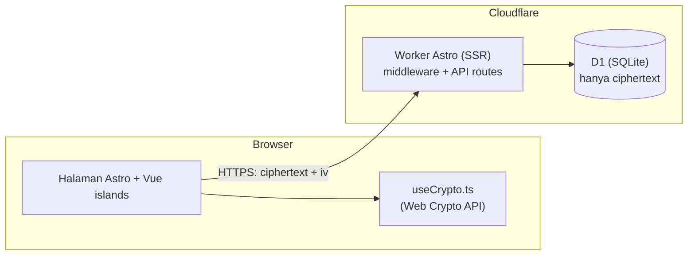
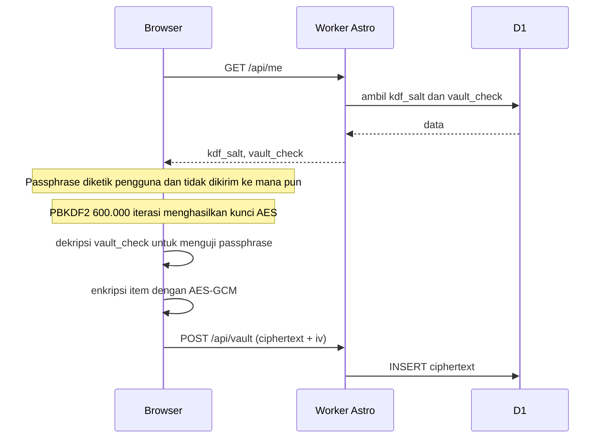
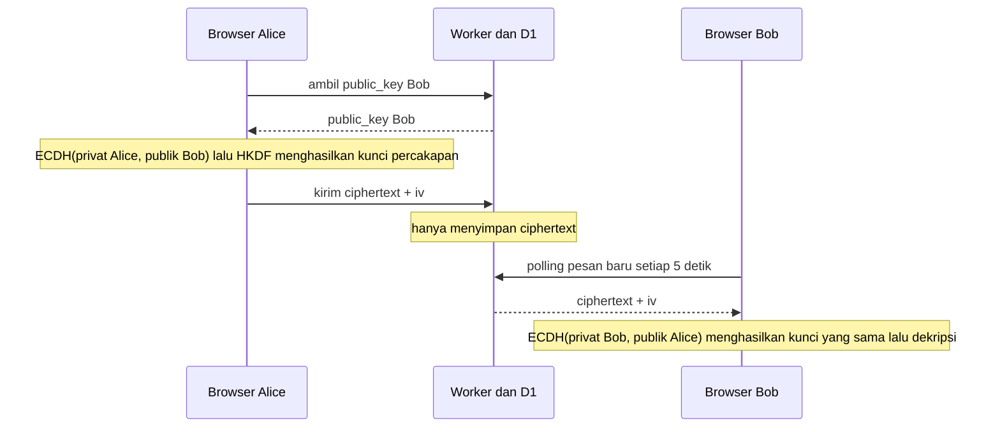
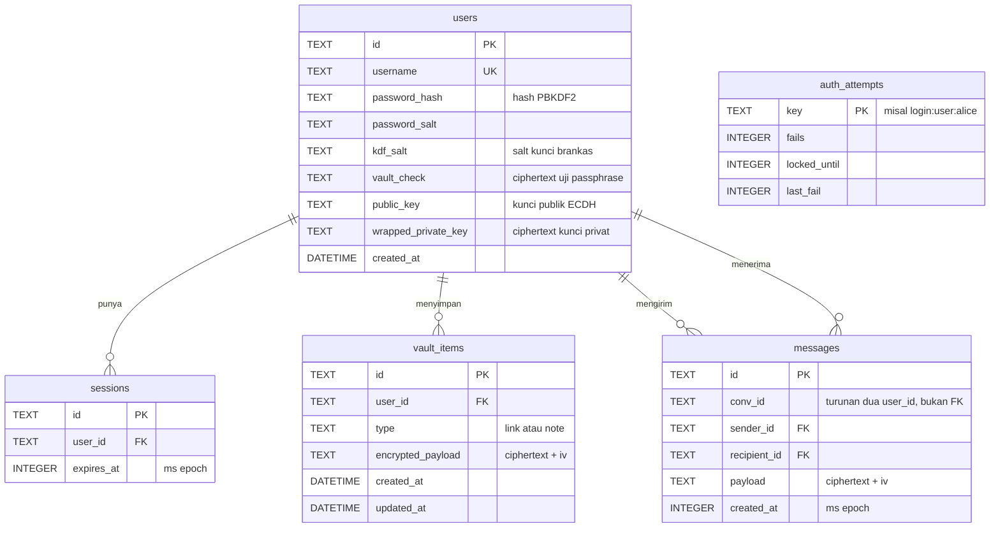

# SMCL — Sistem Manajemen Catatan dan Link

<table>
  <tbody>
    <tr>
      <td width="220" valign="middle">
        <a href="https://claude.ai/" target="_blank" rel="noreferrer">
          
        </a>
      </td>
      <td>
        Dibangun dengan niat Bersama Claude AI 💖.
        jangan ragu konsultasikan kepada claude tentang Arsitektur web ini beserta implementasi pengembangan berdasarkan pola yang telah dilampirkan disini.
      </td>
    </tr>
  </tbody>
</table>

Konteks: **Brankas link dan catatan pribadi, plus chat privat 1-lawan-1, dengan enkripsi end-to-end di sisi browser.**
Server hanya menyimpan data acak yang tidak bisa dibaca.


> **Pernyataan penting di awal.** SMCL dirancang dan didokumentasikan secara terbuka agar layak dipercaya untuk
> **penggunaan pribadi atau tim kecil**. "Terdokumentasi" bukan berarti "teruji secara independen":
> proyek ini **belum diaudit pihak ketiga**. Baca [Model Keamanan](#2-model-keamanan) dan
> [Batasan Teknis](#13-batasan-teknis) sebelum menyimpan data yang benar-benar sensitif.

---

## Daftar Isi

1. [Tentang Proyek](#1-tentang-proyek)
2. [Model Keamanan](#2-model-keamanan)
3. [Arsitektur dan Alur Data](#3-arsitektur-dan-alur-data)
4. [Tech Stack](#4-tech-stack)
5. [Struktur Folder dan Peran Tiap File](#5-struktur-folder-dan-peran-tiap-file)
6. [Referensi API](#6-referensi-api)
7. [Skema Basis Data dan ERD](#7-skema-basis-data-dan-erd)
8. [Panduan Setup Lokal](#8-panduan-setup-lokal)
9. [Uji Sendiri: Buktikan Datanya Terenkripsi](#9-uji-sendiri-buktikan-datanya-terenkripsi)
10. [Deployment ke Cloudflare](#10-deployment-ke-cloudflare)
11. [Prosedur Pemeliharaan Kode](#11-prosedur-pemeliharaan-kode)
12. [Migrasi Keluar dari Cloudflare (SQLite Mandiri)](#12-migrasi-keluar-dari-cloudflare-sqlite-mandiri)
13. [Batasan Teknis](#13-batasan-teknis)
14. [Riwayat Keputusan Desain](#14-riwayat-keputusan-desain)
15. [Kontribusi, Pelaporan Kerentanan, dan Lisensi](#15-kontribusi-pelaporan-kerentanan-dan-lisensi)

---

## 1. Tentang Proyek

### Masalah yang diselesaikan

Di lingkungan kerja, orang sering menyimpan banyak tautan internal (dashboard, server admin, drive) dan catatan
instruksi kerja secara acak: di chat pribadi, file teks, atau catatan peramban. Cara itu memakan waktu, dan berisiko
bila perangkat atau akun layanan penyimpanan jatuh ke tangan orang lain atau diluar jangkauan kita.

### Solusi

SMCL menggabungkan tiga hal dalam satu akun:

| Fitur | Deskripsi |
| :--- | :--- |
| **Brankas Link** | Simpan tautan dengan judul dan keterangan, dengan pencarian di sisi browser. |
| **Brankas Catatan** | Simpan catatan teks panjang. |
| **Chat Privat** | Percakapan 1-lawan-1 antar pengguna terdaftar. Pesan dihapus otomatis setelah 3 hari. |

Semua isi dienkripsi **di browser** sebelum dikirim. Server (Cloudflare Workers) dan basis data (Cloudflare D1)
hanya melihat *ciphertext*.

### Fitur akun dan keamanan

- Pendaftaran dibatasi **kode organisasi** (tanpa kode yang benar, akun tidak bisa dibuat) Kode ini diatur melalui env variable di lingkungan deployment "INVITE_CODE=kodeReferralAnda", jika menguji di lokal, tulis di file root/.dev.vars pastikan ignore di git.
- Login dengan pembatasan percobaan adaptif (penguncian bertahap, per pengguna dan per IP).
- Ganti password (sesi di perangkat lain otomatis dikeluarkan) dan hapus akun permanen.
- Antarmuka responsif (desktop, tablet, ponsel) bergaya *Corporate Clean* dengan font Lato lokal.

### Mengapa stack ini dipilih

Pemilihan teknologi mengikuti empat kendala proyek:

1. **Dikuasai pengembang.** Tidak ada beban belajar yang tidak perlu, sehingga waktu dipakai untuk hal yang menentukan (keamanan dan kriptografi).
2. **Dependensi sesedikit mungkin.** Rantai pasok yang kecil lebih mudah diaudit, dan itu penting untuk aplikasi yang memegang data terenkripsi.
3. **Tanpa server yang harus dirawat.** Mudah diserahterimakan dan tidak butuh administrasi sistem.
4. **Tidak over-engineering.** Skala sasarannya pribadi atau tim kecil.

Ini pilihan berbasis kecocokan dengan kendala di atas, bukan klaim bahwa kombinasi lain buruk.

| Teknologi | Alasan dipilih | Konsekuensi yang diterima |
| :--- | :--- | :--- |
| **Astro 6 (mode SSR)** | Satu framework menangani halaman, API endpoint, dan middleware, jadi tidak perlu backend terpisah. Middleware tunggal menjadi satu-satunya penjaga akses (default-deny). Model *islands* hanya mengirim JavaScript untuk bagian yang interaktif, sedangkan halaman seperti login dan daftar hampir tanpa JS. Render on-demand dibutuhkan karena sesi dicek pada setiap permintaan | Rilis mayor bergerak cepat (proyek ini sendiri terdampak perubahan di Astro 6). Ekosistemnya lebih kecil daripada Next.js |
| **Vue 3 (islands, `client:only`)** | UI yang benar-benar interaktif (form, modal passphrase, daftar hasil dekripsi, chat) membutuhkan reaktivitas. Composition API memudahkan logika dipisah ke *composable* (`useCrypto`, `useVault`, `useChat`), dan pemisahan itulah yang membuat aturan "kripto tidak menyentuh jaringan" mudah diperiksa. `client:only` dipakai karena Web Crypto hanya ada di browser dan dekripsi memang tidak boleh terjadi di server | Komponen tidak dirender di server, yang wajar untuk antarmuka di balik login. React atau Svelte bisa menggantikannya, dan Vue dipilih karena penguasaan pengembang |
| **Cloudflare Workers + D1** | Tanpa server, HTTPS otomatis (wajib, karena Web Crypto membutuhkan *secure context* dan cookie `Secure`), tier gratis memadai, deploy dengan satu perintah. D1 adalah SQLite: data kecil, relasional, dan skemanya portabel (lihat [bagian 12](#12-migrasi-keluar-dari-cloudflare-sqlite-mandiri)) | Terikat pada API platform (`cloudflare:workers`) dan batas kuota/CPU. Dimitigasi dengan jalur migrasi yang terdokumentasi |
| **Tailwind CSS v4** | Design token lewat `@theme` menjaga tampilan *Corporate Clean* tetap konsisten. Gaya berada di kelas utilitas tanpa atribut `style` inline, sehingga selaras dengan CSP yang ketat | Markup menjadi lebih ramai oleh kelas |
| **Web Crypto API (native)** | Diimplementasikan dan diaudit oleh vendor peramban, berakselerasi native, mendukung kunci *non-extractable*, dan menghilangkan library kriptografi pihak ketiga dari rantai pasok | Tidak ada Argon2, sehingga dipakai PBKDF2 (lihat [13.2](#132-passphrase-adalah-titik-tunggal)) |
| **TypeScript** | Tipe untuk `locals`, binding, dan payload mencegah kelas kesalahan yang umum | Sedikit tambahan konfigurasi |
| **`@lucide/vue`** | Impor per ikon sehingga yang terpakai saja yang masuk bundel, dan ia penerus resmi paket lama yang ditandai *deprecated* | Nama ikon perlu dicocokkan dengan versi paket |

**Yang sengaja tidak dipakai:**

| Alternatif | Alasan tidak dipakai |
| :--- | :--- |
| Meta-framework full-stack (Nuxt, Next.js) | Menambah lapisan server dan routing kedua di atas yang sudah disediakan Astro, dan lebih berat untuk aplikasi sekecil ini |
| Backend terpisah (Express, dan sejenisnya) | Server tambahan untuk dirawat, di-deploy, dan diamankan, padahal endpoint Astro sudah cukup |
| ORM (Prisma, Drizzle) | Hanya lima tabel dengan query pendek. SQL terparameter langsung lebih mudah diaudit dan tanpa dependensi tambahan. Layak dipertimbangkan kembali bila skema membesar |
| Library autentikasi (Auth.js, Lucia, dan sejenisnya) | Sesi yang dibutuhkan sederhana, dan kode sendiri memberi kontrol penuh atas cookie serta pembatasan percobaan. Konsekuensinya, keamanan sesi menjadi tanggung jawab proyek ini |
| Library kriptografi (libsodium, CryptoJS, dan sejenisnya) | Web Crypto sudah menyediakan seluruh algoritma yang dibutuhkan |
| State management (Pinia) | Kunci dan status cukup disimpan sebagai `ref` tingkat modul di composable |
| Pustaka komponen UI | Tailwind ditambah beberapa komponen sendiri sudah cukup, dan menjaga CSP tetap sederhana |
| WebSocket atau Durable Objects untuk chat | *Polling* 5 detik lebih sederhana dan cukup untuk skala kecil. Keterbatasan *real-time* dicatat di [13.4](#134-chat) |
| Database selain SQLite (misal PostgreSQL) | Data kecil dan relasinya sederhana, dan SQLite lebih portabel |

Versi dan peran tiap teknologi ada di [bagian 4](#4-tech-stack).

### Yang bukan tujuan proyek ini

SMCL sengaja tidak menyertakan fitur: grup chat, lampiran file, berbagi item antar pengguna, ganti passphrase,
pemulihan passphrase, notifikasi push, dan panel admin. Alasannya adalah menjaga cakupan tetap kecil dan permukaan
serangan tetap sempit. Lihat [Batasan Teknis](#13-batasan-teknis).

---

## 2. Model Keamanan

### 2.1 Prinsip utama

1. **Server tidak pernah menerima passphrase, kunci, atau isi (plaintext) brankas dan chat.**
2. **Dua rahasia yang berbeda dan terpisah:**
   - *Password login* dikirim ke server untuk autentikasi, lalu di-hash.
   - *Passphrase brankas* **tidak pernah meninggalkan browser**. Ia hanya dipakai untuk menurunkan kunci enkripsi.
3. **Seluruh kriptografi memakai Web Crypto API bawaan peramban.** Tidak ada library kriptografi pihak ketiga
   yang bisa disusupi lewat rantai pasok paket.
4. **Default-deny:** semua halaman dan endpoint API wajib login, kecuali yang didaftarkan publik secara eksplisit.
5. **Pertahanan berlapis:** kalau satu lapisan gagal, lapisan lain masih menahan.

### 2.2 Apa yang dilihat server

| Data | Terlihat oleh server? |
| :--- | :--- |
| Username | Ya |
| Password login | Ya, sesaat saat login/daftar, lalu langsung di-hash (tidak disimpan, tidak dicatat di log) |
| Hash password dan salt-nya | Ya (disimpan) |
| **Passphrase brankas** | **Tidak pernah** |
| **Kunci AES brankas dan kunci privat chat** | **Tidak pernah** (hanya ada di memori browser) |
| Judul, URL, isi catatan | Tidak (hanya ciphertext) |
| Isi pesan chat | Tidak (hanya ciphertext) |
| Kunci publik chat | Ya (memang bersifat publik) |
| Jumlah item, tipe (link/catatan), waktu ubah, perkiraan ukuran | Ya (metadata) |
| Siapa berbicara dengan siapa, dan kapan | Ya (metadata) |

### 2.3 Skenario ancaman

| Skenario | Yang didapat penyerang | Isi brankas dan chat aman? |
| :--- | :--- | :--- |
| Basis data bocor (dump/backup/akses internal) | Hash password, salt, ciphertext, metadata | **Aman selama passphrase kuat.** Penyerang bisa menebak passphrase secara offline, dan satu-satunya pertahanan adalah kekuatan passphrase plus biaya PBKDF2 (lihat batasan) |
| Penyadapan jaringan | Hanya lalu lintas HTTPS | Aman |
| Perangkat dicuri, brankas **terkunci** | Akses ke sesi login, bukan ke isi | Aman (butuh passphrase) |
| Perangkat dicuri, brankas **terbuka** | Kunci ada di memori halaman | **Tidak aman** |
| Orang luar mencoba mendaftar | Ditolak kode organisasi dan pembatas | Tidak berlaku |
| Tebak password login | Diperlambat penguncian bertahap | Berlaku pembatasan |
| XSS (penyisipan skrip) | Dipersulit CSP berbasis hash + escaping otomatis Vue | Risiko berkurang, tidak nol |
| Server berbuat curang saat chat (MITM kunci publik) | Bisa menyadap bila pengguna tidak memverifikasi kode keamanan | **Aman hanya jika kode keamanan dicocokkan** |
| Akun Cloudflare, repositori, atau paket npm disusupi | Bisa mengganti kode aplikasi dan mencuri passphrase | **Tidak aman** (batasan inheren E2EE berbasis web) |

### 2.4 Kriptografi yang dipakai

| Tujuan | Algoritma | Parameter | Lokasi |
| :--- | :--- | :--- | :--- |
| Hash password login | PBKDF2-HMAC-SHA256 | 100.000 iterasi (batas Workers), salt acak 16 byte per pengguna, perbandingan waktu-konstan | Server (`src/lib/auth.ts`) |
| Kunci brankas | PBKDF2-HMAC-SHA256 | 600.000 iterasi, salt acak 16 byte per pengguna (`kdf_salt`), kunci **non-extractable** | Browser (`useCrypto.ts`) |
| Enkripsi data | AES-256-GCM | IV acak 12 byte baru untuk setiap enkripsi | Browser |
| Identitas chat | ECDH kurva P-256 | Pasangan kunci per pengguna, kunci privat dibungkus kunci brankas | Browser |
| Kunci percakapan | ECDH lalu HKDF-SHA256 | `info = "smcl-chat-v1:<convId>"` | Browser |
| Integritas chat | AES-GCM *additional data* | `convId|senderId`: ciphertext terikat pada percakapan dan pengirimnya | Browser |
| Kode keamanan | SHA-256 | 15 byte pertama dari hash gabungan dua kunci publik terurut | Browser |
| Sesi login | ID acak (dua UUID v4 digabung) | Cookie `HttpOnly; Secure; SameSite=Lax`, 7 hari | Server |

Bentuk data yang tersimpan di database:

```json
{ "ciphertext": "<base64>", "iv": "<base64>" }
```

Isi sebelum dienkripsi: link `{ title, url, body }`, catatan `{ title, body }`, pesan chat `{ text }`,
uji passphrase `{ ok: true }`.

### 2.5 Lapisan pertahanan lainnya

- **Middleware default-deny** (`src/middleware.ts`): endpoint atau halaman baru otomatis butuh login. Daftar publik hanya
  `/`, `/login`, `/register`, aset statis, dan `/api/auth/*`.
- **Pembatas percobaan adaptif** (`src/lib/throttle.ts`): 5 kegagalan gratis per username (20 per IP), lalu penguncian
  30 detik yang berlipat dua tiap kegagalan hingga maksimum 15 menit. Berlaku untuk login, kode organisasi, dan ganti password.
- **Content Security Policy** lewat fitur `security.csp` Astro (hash otomatis untuk skrip/gaya), dengan
  `connect-src 'self'` sehingga skrip jahat tidak bisa mengirim data ke domain lain.
- **Header keamanan:** `X-Content-Type-Options`, `X-Frame-Options: DENY`, `Referrer-Policy: no-referrer`,
  `Permissions-Policy`, `Cross-Origin-Opener-Policy`, dan HSTS di produksi.
- **Query terparameter:** seluruh SQL memakai `prepare(...).bind(...)`. Satu-satunya SQL dinamis hanya menyusun deretan `?`.
- **Isolasi data:** setiap query data pengguna menyertakan `AND user_id = ?`.
- **URL dibatasi http/https** agar tidak ada `javascript:` di tautan.
- **Kode organisasi disimpan sebagai secret**, dan pendaftaran *gagal tertutup* (ditolak) bila secret belum diatur.

### 2.6 Cara memverifikasi klaim ini sendiri

Jangan percaya klaim, baca kodenya. Tiga file inti cukup untuk memahami seluruh model keamanan:

1. `src/composables/useCrypto.ts` (sekitar seratus baris): semua operasi kriptografi.
2. `src/middleware.ts`: aturan akses dan header keamanan.
3. `src/lib/auth.ts`: hashing password dan pembuatan sesi.

Lalu jalankan [uji enkripsi pada bagian 9](#9-uji-sendiri-buktikan-datanya-terenkripsi).

---

## 3. Arsitektur dan Alur Data



### 3.1 Membuka brankas dan menyimpan item



Kalau brankas baru (belum punya `vault_check`), browser membuat `vault_check` (enkripsi `{ok:true}`),
menyimpannya, dan membuat pasangan kunci chat. Kunci privat chat dienkripsi dengan kunci brankas sebelum dikirim.

### 3.2 Chat privat



Pesan yang lewat 3 hari tidak pernah dikembalikan oleh API (filter saat baca), dan dihapus fisik setiap ada pesan
baru dikirim serta saat daftar pengguna dimuat.

---

## 4. Tech Stack

| Layer | Teknologi | Peran |
| :--- | :--- | :--- |
| Framework | Astro 6 (mode SSR, `output: 'server'`) | Routing berbasis file, render HTML, API endpoint, middleware |
| Adapter | `@astrojs/cloudflare` v13 | Menjalankan Astro sebagai Cloudflare Worker |
| Basis data | Cloudflare D1 | SQLite serverless di jaringan edge |
| UI interaktif | Vue 3 (Astro islands, `client:only="vue"`) | Form E2EE, brankas, chat |
| Styling | Tailwind CSS v4 (`@theme`) | Desain token Corporate Clean, font Lato lokal |
| Kriptografi | Web Crypto API (native) | PBKDF2, AES-GCM, ECDH, HKDF |
| Ikon | `@lucide/vue` | Ikon vektor |

Pengembangan: `wrangler` (CLI Cloudflare) dan `@cloudflare/workers-types`. Tidak ada library kriptografi eksternal.

---

## 5. Struktur Folder dan Peran Tiap File

```text
smcl/
├── public/
│   └── fonts/Lato.woff2            # Font lokal (tanpa CDN)
├── src/
│   ├── components/                 # Komponen Vue (dimuat di browser)
│   │   ├── Navbar.vue              # Navigasi bersama + tombol kunci/ganti password/hapus akun/keluar
│   │   ├── PassphraseModal.vue     # Modal buat/buka passphrase brankas
│   │   ├── VaultManager.vue        # Daftar + form link dan catatan (satu komponen, prop `type`)
│   │   ├── ChatManager.vue         # UI chat: sidebar percakapan + panel pesan
│   │   ├── ChangePasswordModal.vue # Dialog ganti password login
│   │   └── DeleteAccountModal.vue  # Dialog hapus akun
│   ├── composables/                # Logika frontend yang dipakai ulang
│   │   ├── useCrypto.ts            # SEMUA operasi kriptografi (fungsi murni)
│   │   ├── useVault.ts             # Kunci di memori + pembungkus API brankas/akun
│   │   ├── useChat.ts              # Pengiriman/penerimaan pesan + kunci percakapan
│   │   ├── useQr.ts                # Sama seperti useCrypto.ts, file ini murni komputasi tanpa jaringan.
│   │   └── useAccountDialog.ts     # Status buka/tutup dialog lintas komponen
│   ├── layouts/
│   │   └── Layout.astro            # Kerangka HTML, font, viewport
│   ├── lib/                        # Kode bersama server (dan sebagian browser)
│   │   ├── auth.ts                 # Hash password, sesi, perbandingan waktu-konstan
│   │   ├── throttle.ts             # Pembatas percobaan adaptif (tabel auth_attempts)
│   │   └── chat.ts                 # convId, masa berlaku pesan (dipakai server DAN browser)
│   ├── pages/                      # Routing berbasis file
│   │   ├── index.astro             # Pengalihan ke /links atau /login
│   │   ├── login.astro             # Halaman masuk
│   │   ├── register.astro          # Halaman daftar (butuh kode organisasi)
│   │   ├── links.astro             # Halaman brankas link
│   │   ├── notes.astro             # Halaman brankas catatan
│   │   ├── chat.astro              # Halaman chat
│   │   └── api/
│   │       ├── auth/{register,login,logout}.ts
│   │       ├── me.ts               # Data akun sendiri (salt, vault_check, kunci chat)
│   │       ├── vault-check.ts      # Simpan kode uji passphrase (sekali)
│   │       ├── identity.ts         # Simpan kunci publik + kunci privat terbungkus (sekali)
│   │       ├── users.ts            # Daftar pengguna untuk dropdown chat
│   │       ├── vault/{index,[id]}.ts   # CRUD ciphertext brankas
│   │       ├── messages.ts         # Ambil/kirim pesan chat terenkripsi
│   │       ├── conversations.ts    # Pesan terakhir per lawan bicara
│   │       ├── password.ts         # Ganti password login
│   │       └── account.ts          # Hapus akun
│   ├── styles/global.css           # Tailwind v4 + design tokens (@theme) + @font-face
│   ├── env.d.ts                    # Tipe TypeScript (App.Locals.userId)
│   └── middleware.ts               # Sesi, default-deny, header keamanan
├── schema.sql                      # Skema lengkap basis data
├── wrangler.jsonc                  # Konfigurasi Worker + binding D1
├── astro.config.mjs                # Konfigurasi Astro, adapter, Tailwind, CSP
├── .dev.vars                       # Rahasia lokal (TIDAK dikomit)
└── package.json
```

### 5.1 Bagaimana file-file saling berhubungan

Alur satu permintaan, dari layar sampai basis data:

```text
Halaman .astro
   └─ memuat island Vue (client:only) ── karena Web Crypto hanya ada di browser
        └─ komponen (VaultManager / ChatManager)
             └─ composable (useVault / useChat)      ← memegang kunci di memori
                  ├─ useCrypto.ts                    ← enkripsi/dekripsi (tanpa jaringan)
                  └─ fetch → API route (src/pages/api/*)
                               ├─ middleware.ts      ← cek sesi + header keamanan
                               ├─ lib/auth, lib/throttle, lib/chat
                               └─ D1 (env.DB)        ← hanya ciphertext + metadata
```

Aturan penting yang menjaga hubungan ini tetap aman:

- **`useCrypto.ts` tidak pernah melakukan panggilan jaringan**, dan **API route tidak pernah mengimpor `useCrypto.ts`**.
  Pemisahan ini membuat mudah membuktikan bahwa server tidak bisa mendekripsi apa pun.
- **`lib/chat.ts` dipakai oleh dua sisi** supaya rumus `convId` identik di server dan browser.
- **`useVault.ts` menyimpan `CryptoKey` hanya di variabel memori** (`shallowRef`). Tidak ada `localStorage`,
  `sessionStorage`, atau IndexedDB. Reload halaman berarti passphrase diminta lagi, dan itu disengaja.
- **Middleware menjadi satu-satunya penjaga akses.** API route mengandalkan `locals.userId` yang diisi middleware.

---

## 6. Referensi API

Semua endpoint di luar `/api/auth/*` otomatis butuh sesi login (default-deny).

| Method | Path | Akses | Fungsi |
| :--- | :--- | :--- | :--- |
| POST | `/api/auth/register` | Publik (butuh kode organisasi, dibatasi) | Buat akun + sesi |
| POST | `/api/auth/login` | Publik (dibatasi) | Masuk |
| POST | `/api/auth/logout` | Publik | Hapus sesi saat ini |
| GET | `/api/me` | Login | Username, `kdf_salt`, `vault_check`, kunci chat |
| PUT | `/api/vault-check` | Login | Simpan kode uji passphrase (hanya sekali) |
| PUT | `/api/identity` | Login | Simpan kunci publik + kunci privat terbungkus (hanya sekali) |
| GET | `/api/users` | Login | Daftar pengguna lain (`id`, `username`, `public_key`) |
| GET, POST | `/api/vault` | Login | Daftar / tambah item terenkripsi (`?type=link\|note`) |
| PUT, DELETE | `/api/vault/:id` | Login | Ubah / hapus item milik sendiri |
| GET, POST | `/api/messages` | Login | Ambil (`?with=<id>&after=<ms>`) / kirim pesan terenkripsi |
| GET | `/api/conversations` | Login | Pesan terakhir (terenkripsi) per lawan bicara |
| PUT | `/api/password` | Login | Ganti password (butuh password lama) |
| DELETE | `/api/account` | Login | Hapus akun dan seluruh datanya (butuh password) |

---

## 7. Skema Basis Data dan ERD

### 7.1 ERD



### 7.2 Penjelasan entitas

| Tabel | Isi | Catatan keamanan |
| :--- | :--- | :--- |
| `users` | Akun, hash password, dan bahan kunci | `vault_check` dan `wrapped_private_key` adalah ciphertext. `public_key` memang publik |
| `sessions` | Sesi login aktif | ID sesi disimpan apa adanya (lihat batasan) |
| `vault_items` | Link dan catatan | Judul, URL, dan isi berada **di dalam** `encrypted_payload` |
| `messages` | Pesan chat | `conv_id` = dua `user_id` terurut digabung `:`. Ia hanya penanda percakapan, bukan relasi |
| `auth_attempts` | Penghitung kegagalan untuk pembatas | Berdiri sendiri, dibersihkan otomatis setelah 24 jam |

### 7.3 Evolusi dari skema PRD awal

| PRD awal | Skema akhir | Alasan |
| :--- | :--- | :--- |
| 2 tabel (`users`, `vault_items`) | 5 tabel | Butuh sesi, chat, dan pembatas percobaan |
| Salt di tiap payload | Satu `kdf_salt` per pengguna | Kunci cukup diturunkan sekali, bukan per item |
| Kolom `title` (plaintext/opsional) | Dihapus, judul di dalam payload | Judul bisa membocorkan isi |
| Tidak ada verifikasi passphrase | `users.vault_check` | Mendeteksi passphrase salah, meski brankas masih kosong |
| Tidak ada kunci chat | `public_key`, `wrapped_private_key` | Chat E2EE |

### 7.4 Skema lengkap

Sumber kebenaran ada di [`schema.sql`](./schema.sql). Ringkasnya:

```sql
CREATE TABLE IF NOT EXISTS users (
    id TEXT PRIMARY KEY,
    username TEXT NOT NULL UNIQUE,
    password_hash TEXT NOT NULL,
    password_salt TEXT NOT NULL,
    kdf_salt TEXT NOT NULL,
    vault_check TEXT,
    public_key TEXT,
    wrapped_private_key TEXT,
    created_at DATETIME DEFAULT CURRENT_TIMESTAMP
);

CREATE TABLE IF NOT EXISTS sessions (
    id TEXT PRIMARY KEY,
    user_id TEXT NOT NULL,
    expires_at INTEGER NOT NULL,
    FOREIGN KEY (user_id) REFERENCES users(id) ON DELETE CASCADE
);

CREATE TABLE IF NOT EXISTS vault_items (
    id TEXT PRIMARY KEY,
    user_id TEXT NOT NULL,
    type TEXT NOT NULL CHECK (type IN ('link','note')),
    encrypted_payload TEXT NOT NULL,
    created_at DATETIME DEFAULT CURRENT_TIMESTAMP,
    updated_at DATETIME DEFAULT CURRENT_TIMESTAMP,
    FOREIGN KEY (user_id) REFERENCES users(id) ON DELETE CASCADE
);
CREATE INDEX IF NOT EXISTS idx_vault_user ON vault_items(user_id);

CREATE TABLE IF NOT EXISTS auth_attempts (
    key TEXT PRIMARY KEY,
    fails INTEGER NOT NULL DEFAULT 0,
    locked_until INTEGER NOT NULL DEFAULT 0,
    last_fail INTEGER NOT NULL
);

CREATE TABLE IF NOT EXISTS messages (
    id TEXT PRIMARY KEY,
    conv_id TEXT NOT NULL,
    sender_id TEXT NOT NULL,
    recipient_id TEXT NOT NULL,
    payload TEXT NOT NULL,
    created_at INTEGER NOT NULL,
    FOREIGN KEY (sender_id) REFERENCES users(id) ON DELETE CASCADE,
    FOREIGN KEY (recipient_id) REFERENCES users(id) ON DELETE CASCADE
);
CREATE INDEX IF NOT EXISTS idx_msg_conv ON messages(conv_id, created_at);
CREATE INDEX IF NOT EXISTS idx_msg_created ON messages(created_at);
```

---

## 8. Panduan Setup Lokal

Untuk menjalankan dan menguji di komputer sendiri **tidak diperlukan akun Cloudflare**. Basis data D1 lokal
berupa file SQLite di folder `.wrangler/`.

### 8.1 Prasyarat

- Node.js versi LTS terbaru (Astro 6 mensyaratkan Node yang baru, cek `docs.astro.build` untuk versi minimumnya) dan npm
- Git
- Peramban modern (Chrome, Edge, Firefox, Safari). Web Crypto butuh `localhost` atau HTTPS

### 8.2 Langkah

```bash
# 1. Ambil kode dan pasang dependensi
git clone <url-repositori-anda> smcl
cd smcl
npm install
```

```jsonc
// 2. Pastikan wrangler.jsonc memuat binding D1 bernama persis "DB".
//    Untuk lokal, database_id tidak dipakai menghubungi Cloudflare.
//    Jangan tambahkan "remote": true (itu akan memakai database produksi).
"d1_databases": [
  { "binding": "DB", "database_name": "smcl-db", "database_id": "ID-APA-SAJA-UNTUK-LOKAL" }
]
```

```bash
# 3. Buat rahasia lokal (file ini tidak boleh dikomit)
echo "INVITE_CODE=kode-uji-lokal-yang-panjang-dan-acak" > .dev.vars

# 4. Buat tipe TypeScript untuk binding
npx wrangler types

# 5. Buat tabel di database lokal
npx wrangler d1 execute smcl-db --local --file=schema.sql

# 6. Jalankan
npm run dev
```

Buka `http://localhost:4321`, lalu **daftar** dengan `INVITE_CODE` dari `.dev.vars`.

### 8.3 Menyegarkan (reset) database lokal

Database lokal disimpan di `.wrangler/state`. Untuk mengulang dari nol (semua akun dan data uji hilang):

```bash
# Hentikan dulu `npm run dev` (Ctrl+C)

# macOS / Linux / Git Bash
rm -rf .wrangler/state
```

```powershell
# Windows PowerShell
Remove-Item -Recurse -Force .wrangler\state
```

```bash
npx wrangler d1 execute smcl-db --local --file=schema.sql
npm run dev
```

> `CREATE TABLE IF NOT EXISTS` **tidak menambah kolom** ke tabel yang sudah ada. Kalau skema berubah, hapus
> `.wrangler/state` lalu jalankan ulang `schema.sql`, jangan mengandalkan menjalankannya di atas database lama.

Reset yang lebih ringan (akun tetap ada, brankas dan kunci chat dibuat ulang):

```bash
npx wrangler d1 execute smcl-db --local --command "DELETE FROM vault_items"
npx wrangler d1 execute smcl-db --local --command "DELETE FROM messages"
npx wrangler d1 execute smcl-db --local --command "UPDATE users SET vault_check = NULL, public_key = NULL, wrapped_private_key = NULL"
```

Menghapus penguncian percobaan login saat menguji:

```bash
npx wrangler d1 execute smcl-db --local --command "DELETE FROM auth_attempts"
```

### 8.4 Perintah yang tersedia

| Perintah | Fungsi |
| :--- | :--- |
| `npm run dev` | Server pengembangan (`localhost:4321`) |
| `npx astro build` | Build produksi ke `dist/` |
| `npx wrangler dev` | Menjalankan hasil build di runtime Workers lokal (setelah `astro build`) |
| `npm run cf-typegen` | Membuat ulang tipe binding (`wrangler types`) |

### 8.5 Pemecahan masalah umum

| Gejala | Penyebab | Solusi |
| :--- | :--- | :--- |
| `Cannot read properties of undefined (reading 'prepare')` | Nama binding di `wrangler.jsonc` bukan `DB`, atau server belum di-restart | Samakan menjadi `"DB"`, jalankan `npx wrangler types`, restart |
| `Astro.locals.runtime.env has been removed` | Memakai API lama | Pakai `import { env } from 'cloudflare:workers'` |
| `getStaticPaths() function is required` | `output: 'server'` hilang dari `astro.config.mjs` | Tambahkan kembali |
| `no such table` / `no such column` | Skema lokal tidak lengkap atau usang | Reset seperti bagian 8.3 |
| Halaman tanpa gaya | Plugin Tailwind belum ada di `vite.plugins`, atau CSS tidak diimpor di `Layout.astro` | Periksa `astro.config.mjs` dan impor CSS |
| Endpoint baru 404 | Salah nama/lokasi file (misal `-` vs `_`), atau server belum di-restart | Periksa jalur file, restart |
| Pendaftaran selalu "Kode organisasi tidak valid" | `INVITE_CODE` belum diisi di `.dev.vars` | Isi, lalu restart |
| "Terlalu banyak percobaan" saat uji | Pembatas bekerja sesuai desain | `DELETE FROM auth_attempts` (lokal) |
| Modal "Buat passphrase" muncul terus | `vault_check` gagal tersimpan (biasanya endpoint 404/500) | Cek tab Network dan terminal |
| Dev dan `--local` memakai data berbeda | `"remote": true` masih ada di konfigurasi D1 | Hapus opsi itu |

---

## 9. Uji Sendiri: Buktikan Datanya Terenkripsi

Bagian ini membuat Anda tidak perlu percaya klaim README. Anda membuktikannya dari database.

### 9.1 Siapkan data uji lewat antarmuka

Gunakan teks yang mudah dicari dan tidak mungkin muncul acak di data terenkripsi:

1. Daftar akun `alice` dan buat passphrase (minimal 12 karakter).
2. Di **Link**: judul `JUDUL-RAHASIA-789`, URL `https://situs-rahasia.example.com`.
3. Di **Catatan**: judul `Uji`, isi `KATA-RAHASIA-123`.
4. Daftar akun kedua `bob` (jendela incognito), buka `/chat` dengan passphrase-nya, lalu di akun `alice`
   kirim pesan `PESAN-RAHASIA-456` kepada `bob`.

### 9.2 Periksa isi database

Semua perintah memakai `--local`. Di produksi ganti dengan `--remote` (hati-hati, itu data nyata).

**Lihat daftar tabel dan kolom:**

```bash
npx wrangler d1 execute smcl-db --local --command "SELECT name FROM sqlite_master WHERE type='table'"
npx wrangler d1 execute smcl-db --local --command "PRAGMA table_info(users)"
```

**Item brankas: harus berupa `ciphertext` dan `iv` acak, tanpa judul/URL yang terbaca:**

```bash
npx wrangler d1 execute smcl-db --local --command "SELECT type, encrypted_payload FROM vault_items"
```

**Cari teks asli di semua tabel data (semuanya harus 0):**

```bash
npx wrangler d1 execute smcl-db --local --command "SELECT COUNT(*) AS ditemukan FROM vault_items WHERE encrypted_payload LIKE '%JUDUL-RAHASIA-789%' OR encrypted_payload LIKE '%situs-rahasia%' OR encrypted_payload LIKE '%KATA-RAHASIA-123%'"
npx wrangler d1 execute smcl-db --local --command "SELECT COUNT(*) AS ditemukan FROM messages WHERE payload LIKE '%PESAN-RAHASIA-456%'"
```

**Pesan chat: hanya ciphertext, plus metadata (siapa, kapan):**

```bash
npx wrangler d1 execute smcl-db --local --command "SELECT sender_id, recipient_id, substr(payload,1,100) AS payload, created_at FROM messages"
```

**Bahan kunci di tabel `users`: salt, kode uji, kunci publik, dan kunci privat terbungkus:**

```bash
npx wrangler d1 execute smcl-db --local --command "SELECT username, kdf_salt, substr(vault_check,1,80) AS vault_check FROM users"
npx wrangler d1 execute smcl-db --local --command "SELECT username, substr(public_key,1,40) AS public_key, substr(wrapped_private_key,1,80) AS kunci_privat_terbungkus FROM users"
```

**Password login: hanya hash, bukan password aslinya:**

```bash
npx wrangler d1 execute smcl-db --local --command "SELECT username, substr(password_hash,1,16) AS hash_awal, length(password_hash) AS panjang FROM users"
```

**Sesi dan penghitung percobaan (untuk memahami metadata yang tersimpan):**

```bash
npx wrangler d1 execute smcl-db --local --command "SELECT substr(id,1,8) AS sid_awal, user_id, expires_at FROM sessions"
npx wrangler d1 execute smcl-db --local --command "SELECT key, fails, locked_until FROM auth_attempts"
```

**Uji paling ketat: ekspor seluruh database lalu cari teks asli di seluruh isinya:**

```bash
npx wrangler d1 export smcl-db --local --output=dump.sql
grep -c "KATA-RAHASIA-123\|JUDUL-RAHASIA-789\|PESAN-RAHASIA-456\|situs-rahasia" dump.sql
```

```powershell
# Windows PowerShell
(Select-String -Path dump.sql -Pattern "KATA-RAHASIA-123","JUDUL-RAHASIA-789","PESAN-RAHASIA-456","situs-rahasia").Count
```

Hasil yang benar adalah `0`. Ingat: `dump.sql` berisi hash password dan ciphertext, jadi jangan dikomit
(tambahkan ke `.gitignore`) dan hapus setelah pengujian. Perintah `d1 export` bergantung pada versi Wrangler Anda,
jadi periksa `npx wrangler d1 export --help` bila gagal.

### 9.3 Uji perilaku keamanan

| # | Uji | Hasil yang benar |
| :--- | :--- | :--- |
| 1 | Kunci brankas, buka lagi dengan passphrase **salah** | "Passphrase salah." |
| 2 | Buka `/links` dan `/api/me` di jendela incognito tanpa login | Dialihkan ke `/login` / `401 Unauthorized` |
| 3 | Daftar dengan kode organisasi salah | Ditolak, akun tidak terbuat |
| 4 | Gagal login 5 kali berturut-turut, lalu masukkan password **benar** | Tetap ditolak dengan pesan penguncian |
| 5 | Ubah `sender_id` sebuah pesan lalu muat ulang chat (di bawah) | Pesan tampil "[Pesan tidak dapat dibuka]" (bukti server tidak bisa memalsukan pengirim) |
| 6 | Mundurkan pesan 4 hari lalu muat ulang (di bawah) | Pesan hilang dari layar, dan terhapus fisik saat ada pesan baru |
| 7 | Buka Console browser, jalankan `fetch('https://example.com')` | Ditolak CSP (`connect-src`) |
| 8 | Ketik `document.cookie` di Console | Cookie `sid` tidak muncul (HttpOnly) |
| 9 | DevTools, tab Application: periksa localStorage dan sessionStorage | Kosong, tidak ada kunci/passphrase |
| 10 | DevTools, tab Network: buka respons `/api/vault` dan `/api/conversations` | Hanya `ciphertext` dan `iv` |
| 11 | Buat catatan berjudul `` | Tampil sebagai teks biasa, tanpa popup |
| 12 | Login `' OR '1'='1` sebagai username | "Username atau password salah." |
| 13 | Login dua perangkat, ganti password di salah satunya | Perangkat lain dikeluarkan |
| 14 | Ganti password lalu buka brankas dengan passphrase yang sama | Semua data tetap terbaca |
| 15 | Hapus akun uji, lalu periksa tabel | Baris `users`, `vault_items`, `sessions`, `messages` terkait hilang |

Uji 5 dan 6 (ubah data langsung, gunakan data uji saja):

```bash
# Uji 5: palsukan pengirim pesan terbaru
npx wrangler d1 execute smcl-db --local --command "UPDATE messages SET sender_id = recipient_id WHERE id = (SELECT id FROM messages ORDER BY created_at DESC LIMIT 1)"

# Uji 6: buat pesan tertua berumur 4 hari (345600000 ms)
npx wrangler d1 execute smcl-db --local --command "UPDATE messages SET created_at = created_at - 345600000 WHERE id = (SELECT id FROM messages ORDER BY created_at LIMIT 1)"
npx wrangler d1 execute smcl-db --local --command "SELECT COUNT(*) AS jumlah FROM messages"
```

---

## 10. Deployment ke Cloudflare

Adapter v13 membangun aplikasi sebagai **Cloudflare Worker** (bukan Pages). Perintah yang dipakai adalah
`wrangler deploy`.

### 10.1 Persiapan

- `schema.sql` lengkap (bagian 7.4), `wrangler.jsonc` berisi binding `DB` dengan `database_id` asli dan **tanpa** `"remote": true`.
- `.gitignore` memuat `.dev.vars`, `.wrangler/`, `dist/`, `node_modules/`, dan `dump.sql`.
- Uji build produksi secara lokal (CSP dan header bisa berperilaku berbeda dari mode dev):

```bash
npx astro build
npx wrangler dev
```

### 10.2 Langkah

```bash
# 1. Login dan pastikan database ada
npx wrangler login
npx wrangler d1 list                      # atau: npx wrangler d1 create smcl-db

# 2. Migrasi skema ke D1 remote lalu verifikasi
npx wrangler d1 execute smcl-db --remote --file=schema.sql
npx wrangler d1 execute smcl-db --remote --command "SELECT name FROM sqlite_master WHERE type='table'"

# 3. Build dan deploy
npx astro build
npx wrangler deploy

# 4. Set kode organisasi produksi (buat berbeda dari kode lokal)
npx wrangler secret put INVITE_CODE
```

Sebelum secret diisi, pendaftaran ditolak total (gagal tertutup), dan itu perilaku yang benar.

### 10.3 Setelah online

- Uji ulang tabel 9.3 di alamat produksi, dan periksa lognya dengan `npx wrangler tail`.
- Pasang aturan rate limiting tambahan di dashboard Cloudflare untuk `/api/auth/login` sebagai lapisan luar.
- Pantau penggunaan D1 beberapa hari pertama (polling chat menghasilkan banyak pembacaan).
- Jangan menjalankan `DELETE`/`UPDATE` massal dengan `--remote` sembarangan: itu data nyata.
- Deploy otomatis dari GitHub (Workers Builds): build command `npx astro build`, deploy command `npx wrangler deploy`.
  Binding D1 sudah ada di `wrangler.jsonc`, dan secret diisi di dashboard. Perubahan `schema.sql` tetap harus
  dijalankan manual dengan `--remote`.

---

## 11. Prosedur Pemeliharaan Kode

### 11.1 Rutinitas

| Frekuensi | Tindakan |
| :--- | :--- |
| Setiap perubahan | Branch terpisah, review, jalankan tabel uji 9.3 yang relevan |
| Mingguan | `npm audit` dan `npm outdated`, tinjau peringatan keamanan |
| Bulanan | Perbarui dependensi minor/patch, jalankan seluruh tabel 9.3, bersihkan sesi kedaluwarsa (11.6) |
| Per rilis | Beri tag versi (SemVer), catat perubahan di `CHANGELOG.md`, deploy, uji di produksi |
| Berkala (misal 6 bulan) | Tinjau ulang parameter kripto (iterasi PBKDF2) terhadap rekomendasi OWASP terbaru |

### 11.2 Memperbarui dependensi

Ekosistem ini bergerak cepat. Proyek ini sendiri pernah terkena perubahan besar (Astro 6 menghapus `locals.runtime`).

1. Commit `package-lock.json` dan jangan mengabaikannya.
2. Perbarui minor/patch dulu (`npm update`). Untuk versi mayor (Astro, adapter, Vue, Tailwind, Wrangler), baca
   catatan rilis/panduan migrasinya **sebelum** memperbarui.
3. Setelah memperbarui: `npx wrangler types`, `npx astro build`, `npx wrangler dev`, lalu jalankan uji 9.3.
4. Pantau dua hal yang paling sensitif terhadap versi: cara akses D1 (`cloudflare:workers`) dan konfigurasi `security.csp`.
5. Pertahankan prinsip: **jangan menambah library kriptografi eksternal** tanpa alasan kuat dan review yang serius.

### 11.3 Mengubah skema basis data

Saat ini skema dikelola lewat satu `schema.sql`. Untuk pemeliharaan jangka panjang, beralihlah ke migrasi bernomor
bawaan Wrangler:

```bash
npx wrangler d1 migrations create smcl-db tambah_kolom_x     # membuat migrations/0001_....sql
npx wrangler d1 migrations apply smcl-db --local
npx wrangler d1 migrations apply smcl-db --remote
```

Aturan: **jangan mengubah migrasi yang sudah diterapkan**, selalu tambah berkas baru, dan perbarui `schema.sql`
agar tetap mencerminkan skema akhir (untuk instalasi baru). Ingat `CREATE TABLE IF NOT EXISTS` tidak menambah kolom.

### 11.4 Mengubah kriptografi (paling berisiko)

Data terenkripsi yang sudah tersimpan **tidak bisa dibaca ulang** bila parameternya berubah tanpa strategi migrasi.
Payload saat ini **tidak membawa nomor versi**. Sebelum mengubah apa pun berikut, rancang migrasi lebih dulu:

- jumlah iterasi PBKDF2, algoritma turunan kunci, atau format `kdf_salt`
- format AAD chat atau string `info` HKDF (`smcl-chat-v1:`)
- format isi payload

Saran: tambahkan bidang versi (misal `v: 2`) pada payload dan `users` sebelum perubahan pertama, sehingga kode
lama dan baru bisa hidup berdampingan sementara data dimigrasi saat pengguna membuka brankasnya.

### 11.5 Daftar periksa review keamanan per perubahan

- [ ] Semua SQL memakai `prepare(...).bind(...)`, tanpa menyambung input ke teks query
- [ ] Endpoint baru tidak masuk daftar publik middleware tanpa alasan kuat
- [ ] Query data pengguna menyertakan `AND user_id = ?`
- [ ] Tidak ada `console.log` yang mencetak body permintaan pada endpoint auth
- [ ] Tidak ada `localStorage`/`sessionStorage`/IndexedDB untuk kunci atau passphrase
- [ ] Tidak ada `v-html`, `innerHTML`, atau atribut `style` inline (menjaga CSP)
- [ ] Tautan yang dirender hanya http/https
- [ ] Endpoint yang menerima password memakai pembatas percobaan
- [ ] Batas ukuran input ditegakkan di server, bukan hanya di form
- [ ] `server` tidak mengimpor `useCrypto.ts`, dan `useCrypto.ts` tidak melakukan jaringan

### 11.6 Pembersihan dan backup

Sesi yang kedaluwarsa tidak dihapus otomatis. Bersihkan berkala:

```bash
npx wrangler d1 execute smcl-db --remote --command "DELETE FROM sessions WHERE expires_at < strftime('%s','now') * 1000"
```

Backup:

```bash
npx wrangler d1 export smcl-db --remote --output=backup.sql
```

Berkas backup berisi hash password dan ciphertext. Perlakukan sebagai data sensitif dan simpan terenkripsi.
D1 juga menyediakan *Time Travel* untuk memulihkan ke titik waktu tertentu (periksa lama retensinya untuk paket Anda).

### 11.7 Rotasi rahasia dan penanganan insiden

| Kejadian | Tindakan |
| :--- | :--- |
| Kode organisasi bocor | `npx wrangler secret put INVITE_CODE` dengan nilai baru. Akun yang sudah ada tidak terpengaruh |
| Curiga sesi dicuri | `DELETE FROM sessions` (semua orang harus login ulang) |
| Password satu pengguna bocor | Pengguna mengganti password (sesi lain otomatis keluar). Passphrase tidak terpengaruh |
| **Akun Cloudflare/repositori/deploy disusupi** | Anggap passphrase yang diketik selama periode itu bisa tercuri. Karena belum ada fitur ganti passphrase, pemulihannya adalah membuat akun baru dan memindahkan data secara manual. Lihat batasan 13.1 |

### 11.8 Pengujian otomatis (saran)

Repositori ini saat ini mengandalkan uji manual (bagian 9). Langkah berikutnya yang paling bernilai adalah
uji unit untuk `useCrypto.ts` (misal dengan Vitest): enkripsi lalu dekripsi harus kembali ke data awal,
kunci salah harus gagal, AAD berbeda harus gagal, dan kode keamanan harus simetris.

---

## 12. Migrasi Keluar dari Cloudflare (SQLite Mandiri)

Karena E2EE dilakukan di browser, **data terenkripsi tidak terikat pada tempat penyimpanannya**. Yang terikat
pada Cloudflare hanya lapisan akses data dan hosting. D1 adalah SQLite, jadi skemanya dapat dipakai apa adanya.

> Bagian ini adalah **prosedur rancangan**. Kode contohnya belum diuji di repositori ini. Verifikasi tiap langkah
> pada salinan data sebelum mengganti produksi.

### 12.1 Apa yang terikat pada Cloudflare

| Komponen | Lokasi | Pengganti |
| :--- | :--- | :--- |
| Akses D1 (`env.DB`) | Sekitar 17 file: `middleware.ts`, semua `api/*`, `lib/auth.ts`, `lib/throttle.ts`, `lib/chat.ts` | Lapisan akses data sendiri (12.2) |
| Adapter `@astrojs/cloudflare` | `astro.config.mjs` | `@astrojs/node` |
| Rahasia dan variabel (`INVITE_CODE`) | `cloudflare:workers` `env`, `.dev.vars` | `process.env` / berkas `.env` |
| IP klien | Header `CF-Connecting-IP` di `throttle.ts` | `X-Forwarded-For` dari reverse proxy Anda, atau `clientAddress` |
| `db.batch([...])` (transaksi D1) | `vault`, `messages`, `account`, `password` | Transaksi SQLite |
| Konfigurasi dan deploy | `wrangler.jsonc`, `wrangler deploy` | Docker / proses Node + reverse proxy |
| Batas PBKDF2 100.000 iterasi | `lib/auth.ts` | Tidak berlaku di Node (bisa dinaikkan, lihat 12.5) |

### 12.2 Langkah 1: sisipkan lapisan akses data

Buat satu antarmuka sehingga endpoint tidak memanggil D1 secara langsung.

```ts
// src/lib/db.ts
export interface Db {
  first<T>(sql: string, ...params: unknown[]): Promise<T | null>;
  all<T>(sql: string, ...params: unknown[]): Promise<T[]>;
  run(sql: string, ...params: unknown[]): Promise<{ changes: number }>;
  batch(stmts: { sql: string; params?: unknown[] }[]): Promise<void>;
}
```

Implementasi SQLite mandiri dengan `better-sqlite3` (contoh, belum diuji di repositori ini):

```ts
// src/lib/db.sqlite.ts
import Database from 'better-sqlite3';
import type { Db } from './db';

const sqlite = new Database(process.env.DB_PATH ?? './data/smcl.db');
sqlite.pragma('journal_mode = WAL');
sqlite.pragma('foreign_keys = ON');   // SQLite mati secara bawaan, D1 selalu aktif
sqlite.pragma('busy_timeout = 5000');

export const db: Db = {
  async first(sql, ...p) { return (sqlite.prepare(sql).get(...p) as any) ?? null; },
  async all(sql, ...p) { return sqlite.prepare(sql).all(...p) as any; },
  async run(sql, ...p) { return { changes: sqlite.prepare(sql).run(...p).changes }; },
  async batch(stmts) {
    sqlite.transaction(() => {
      for (const s of stmts) sqlite.prepare(s.sql).run(...(s.params ?? []));
    })();
  },
};
```

Lalu ganti setiap `env.DB.prepare(sql).bind(a, b).first()` menjadi `db.first(sql, a, b)`, dan
`res.meta.changes` menjadi `res.changes`. Lakukan bertahap dan jalankan uji 9.3 setelah tiap kelompok file.

Catatan: `throttle.ts` memakai placeholder bernomor (`?1`, `?2`) pada upsert. SQLite mendukungnya, tetapi verifikasi
perilaku driver yang Anda pilih.

### 12.3 Langkah 2: ganti adapter dan konfigurasi

```bash
npm uninstall @astrojs/cloudflare
npx astro add node
```

```js
// astro.config.mjs (bagian yang berubah)
import node from '@astrojs/node';

export default defineConfig({
  output: 'server',
  adapter: node({ mode: 'standalone' }),
  // security.csp, integrations, dan vite.plugins tetap sama
});
```

- Ganti `import { env } from 'cloudflare:workers'` dengan `process.env` (khusus kode server).
- Ganti `CF-Connecting-IP` di `throttle.ts`. **Percayai `X-Forwarded-For` hanya bila berasal dari reverse proxy Anda sendiri**, kalau tidak, penyerang bisa memalsukan IP untuk menghindari pembatas.
- Hapus `wrangler.jsonc`, `worker-configuration.d.ts`, dan skrip `cf-typegen`.

### 12.4 Langkah 3: pindahkan data

```bash
# 1. Cadangkan dan ekspor dari D1
npx wrangler d1 export smcl-db --remote --output=dump.sql

# 2. Impor ke SQLite
mkdir -p data && sqlite3 data/smcl.db < dump.sql

# 3. Verifikasi jumlah baris dan integritas
sqlite3 data/smcl.db "PRAGMA integrity_check; PRAGMA foreign_key_check; SELECT COUNT(*) FROM users; SELECT COUNT(*) FROM vault_items;"
```

Kolom `users.kdf_salt`, `vault_check`, `public_key`, dan `wrapped_private_key` **harus terbawa persis**: keempatnya
diperlukan browser untuk menurunkan kunci dan membuka brankas. Tabel `sessions` dan `auth_attempts` boleh dikosongkan
(pengguna cukup login ulang).

Bukti migrasi berhasil: login dengan akun lama, masukkan passphrase lama, dan semua link, catatan, serta pesan yang
belum kedaluwarsa harus terbaca. Kode klien tidak berubah sama sekali.

### 12.5 Langkah 4: hosting mandiri

```bash
npx astro build
HOST=127.0.0.1 PORT=4321 INVITE_CODE=... DB_PATH=./data/smcl.db node ./dist/server/entry.mjs
```

- **Wajib HTTPS**: Web Crypto membutuhkan secure context, dan cookie `Secure` tidak dikirim lewat HTTP. Pasang reverse
  proxy dengan sertifikat otomatis, misalnya Caddy:

```text
smcl.contoh.com {
    reverse_proxy 127.0.0.1:4321
}
```

- Pindahkan HSTS dan header keamanan yang bergantung pada proxy bila perlu.
- Jalankan sebagai layanan (systemd/Docker) dengan pengguna non-root.
- Backup: `sqlite3 data/smcl.db ".backup 'backup.db'"` terjadwal, atau replikasi berkelanjutan dengan Litestream.
- Pembersihan sesi kedaluwarsa dan pesan lama dapat dijadwalkan dengan cron/systemd timer, sebagai pengganti pembersihan oportunistik.

**Peluang peningkatan:** di Node tidak ada batas 100.000 iterasi PBKDF2 untuk hash password. Untuk menaikkannya tanpa
mengunci pengguna lama, simpan jumlah iterasi per pengguna dan hash ulang saat login berhasil berikutnya.

### 12.6 Alternatif dan rencana mundur

- **Turso/libSQL**: kompatibel SQLite dan bisa dijalankan sendiri, dengan perubahan kode paling kecil (klien `@libsql/client` menggantikan `better-sqlite3`).
- **PostgreSQL**: lebih banyak penyesuaian (placeholder `$1`, tipe waktu, `COLLATE NOCASE` menjadi `lower()`/`citext`) dan biasanya tidak sebanding untuk skala ini.
- **Rencana mundur:** simpan D1 dan Worker lama tetap berjalan sampai migrasi terverifikasi. Ingat bahwa data yang dibuat setelah ekspor tidak ikut terbawa, jadi lakukan pemindahan pada jendela waktu yang tenang dan bekukan penulisan selama ekspor.

---

## 13. Batasan Teknis

Bagian ini sengaja panjang. Memahami batasan sama pentingnya dengan memahami fitur.

### 13.1 Kepercayaan pada kode yang disajikan server

E2EE berbasis web punya kelemahan yang tidak bisa dihilangkan: **JavaScript yang mengenkripsi datamu dikirim oleh server yang sama**.
Bila akun Cloudflare, repositori, jalur deploy, atau salah satu paket npm disusupi, penyerang dapat mengganti kode agar
mencuri passphrase saat diketik. CSP, kunci versi dependensi, dan 2FA pada akun hosting/GitHub mengurangi risikonya,
tetapi tidak menghilangkannya. Aplikasi terpasang (native) atau ekstensi peramban yang ditandatangani punya jaminan lebih kuat.
Karena belum ada fitur ganti passphrase, pemulihan setelah kompromi adalah akun baru dan pemindahan data manual.

### 13.2 Passphrase adalah titik tunggal

- **Tebakan offline:** siapa pun yang memegang salinan database memiliki `kdf_salt`, `vault_check`, dan ciphertext,
  sehingga dapat menebak passphrase sepuasnya tanpa pembatas. Satu-satunya pertahanan adalah kekuatan passphrase dan biaya PBKDF2.
- **PBKDF2 tidak *memory-hard*:** rentan terhadap serangan GPU/ASIC dibanding Argon2id atau scrypt. Web Crypto tidak menyediakan
  Argon2, sehingga memakainya berarti menambah library WebAssembly pihak ketiga (trade-off yang sengaja dihindari).
- **Satu kunci untuk semuanya:** link, catatan, dan kunci privat chat dilindungi oleh passphrase yang sama.
- **Tidak ada ganti passphrase dan tidak ada pemulihan.** Lupa berarti data hilang selamanya. Mereset brankas
  membuat kunci chat baru, sehingga riwayat chat lama tidak terbaca dan kode keamanan berubah di mata lawan bicara.
- **Password login dilihat server** sesaat sebelum di-hash. Hash password di server hanya 100.000 iterasi (batas Workers).
  Jangan memakai passphrase yang sama dengan password login.
- **Memori JavaScript tidak bisa dijamin terhapus.** String passphrase tetap berada di *heap* sampai *garbage collector* bekerja.
  Kunci diturunkan sebagai *non-extractable* (tidak bisa diekspor), tetapi masih bisa dipakai selama halaman terbuka.
  Pengelola password, ekstensi peramban, atau malware pada perangkat dapat membaca layar atau isian.

### 13.3 Metadata dan integritas

- **Metadata terlihat server:** username, jumlah dan jenis item, waktu ubah, perkiraan ukuran, serta siapa berbicara dengan siapa dan kapan.
- **Daftar pengguna terbuka bagi semua anggota** (`id`, `username`, `public_key`), demi dropdown chat. Endpoint pendaftaran juga
  membedakan "username sudah dipakai", sehingga keberadaan akun bisa ditebak.
- **Item brankas tidak terikat pada ID-nya.** Server (atau pihak dengan akses database) dapat menukar isi antar-item milik satu
  pengguna, atau mengembalikan versi lama sebuah item, tanpa terdeteksi. Chat lebih baik (terikat percakapan dan pengirim
  lewat AAD), tetapi server masih bisa menahan, menghapus, mengurutkan ulang, atau menduplikasi pesan karena tidak ada nomor urut.

### 13.4 Chat

- **Tidak ada *forward secrecy*:** kunci ECDH bersifat statis. Bila kunci privat seseorang bocor (passphrase + salinan database),
  seluruh riwayat yang pernah diambil penyerang dapat dibuka. Protokol seperti Double Ratchet mengatasinya, tetapi jauh di luar cakupan.
- **Kepercayaan pada kunci publik (TOFU):** server yang membagikan kunci publik dan bisa menukarnya (serangan MITM). Perlindungannya
  hanya bila kedua pihak mencocokkan **kode keamanan** lewat kanal lain. Aplikasi **belum memberi peringatan otomatis** saat kunci
  lawan bicara berubah.
- **Kedaluwarsa 3 hari hanya berlaku di server.** Lawan bicara bisa menyalin atau menangkap layar. Backup/salinan database
  serta fitur *Time Travel* D1 dapat menyimpan pesan yang sudah "dihapus" lebih lama dari 3 hari.
- **Pembersihan bersifat oportunistik:** penghapusan fisik terjadi saat ada pesan dikirim atau daftar pengguna dimuat. Di aplikasi
  yang sepi, ciphertext kedaluwarsa dapat tetap tersimpan meski tidak lagi bisa diambil lewat API.
- **Bukan *real-time*:** pembaruan lewat *polling* setiap 5 detik hanya saat tab terlihat, jadi ada jeda hingga beberapa detik.
  Tidak ada notifikasi, penanda dibaca, grup, atau lampiran. Riwayat dimuat maksimal 200 pesan terbaru per percakapan.

### 13.5 Sesi, akses, dan pembatas

- **ID sesi disimpan apa adanya** di tabel `sessions`. Bila database bocor, sesi yang belum kedaluwarsa dapat dipakai sampai habis
  masa berlakunya (7 hari, tetap, tanpa perpanjangan otomatis). Menyimpan hash ID sesi akan memperbaikinya.
- Tidak ada daftar perangkat atau pencabutan sesi per perangkat (kecuali ganti password yang mengeluarkan semua sesi lain).
- **Proteksi CSRF** mengandalkan cookie `SameSite=Lax` dan permintaan JSON, tanpa token CSRF terpisah.
- **Pembatas percobaan** memakai pola baca-lalu-tulis di D1 yang tidak atomik: lonjakan permintaan bersamaan dapat lolos beberapa kali
  ekstra. Ia juga memungkinkan pihak lain mengunci sebuah username hingga 15 menit (*denial of service* kecil). Tidak ada CAPTCHA.
  Pembatas per IP bergantung pada header `CF-Connecting-IP` dan terpengaruh jaringan yang berbagi IP (NAT kantor).
- **Kode organisasi adalah satu rahasia bersama.** Siapa pun yang memilikinya bisa mendaftar. Tidak ada undangan per orang,
  peran admin, atau antarmuka untuk menonaktifkan pengguna. Pengelolaan akun bermasalah dilakukan langsung lewat basis data.
- **Tidak ada "lupa password".** Tanpa email, tidak ada jalur pemulihan otomatis. Administrator dapat mengatur ulang hash
  password lewat basis data tanpa merusak isi brankas (passphrase tidak terlibat), tetapi fiturnya belum dibangun.

### 13.6 Skalabilitas dan batas platform

- **Semua item didekripsi di browser saat dimuat,** dan pencarian dilakukan di memori. Brankas yang sangat besar akan melambat.
  Daftar brankas belum berpaginasi. Setiap baris D1 dibatasi ukurannya (sekitar 2 MB menurut dokumentasi Cloudflare, verifikasi angka terbaru).
- **Derivasi kunci membutuhkan waktu nyata:** 600.000 iterasi PBKDF2 memakan waktu sepersekian hingga beberapa detik
  tergantung perangkat, dan dilakukan setiap kali brankas dibuka (setiap pindah halaman atau reload).
- **Batas paket Cloudflare:** jumlah baca/tulis D1 harian, dan batas CPU per permintaan Worker. Hashing password di server
  (100.000 iterasi) adalah operasi yang cukup berat, jadi pantau kegagalan login akibat batas CPU pada paket gratis.
  Polling chat menghabiskan kuota baca dengan cepat bila banyak tab terbuka.
- **Konsistensi D1:** database utama berada di satu wilayah. Latensi bergantung pada jarak ke wilayah itu.
- **Ketergantungan versi:** Astro 6 dan adapter v13 masih baru. Perubahan yang memutus kompatibilitas mungkin muncul pada pembaruan.
  Kode terikat pada API `cloudflare:workers` (lihat bagian 12 untuk jalan keluarnya).

### 13.7 Cakupan verifikasi dan kepatuhan

- **Belum ada audit keamanan independen** dan tidak ada verifikasi formal.
- **Belum ada uji otomatis;** pengujian dilakukan manual (bagian 9). Regresi mungkin lolos tanpa terdeteksi.
- Istilah "zero-knowledge" di sini berarti **server tidak dapat membaca isi** (bukan bukti tanpa-pengetahuan dalam arti kriptografis),
  dan hanya berlaku untuk isi brankas dan chat. Proses login **tidak** zero-knowledge.
- Tidak dirancang untuk kepatuhan regulasi (misal GDPR, HIPAA) atau data yang sangat teregulasi.
- Model ancaman yang **tidak** ditangani: penyerang berkemampuan tingkat negara, malware pada perangkat pengguna,
  pengamat yang menyusup ke dalam browser pengguna, dan penyalahgunaan oleh orang dalam yang memegang akses penuh ke akun hosting.

### 13.8 Cocok dan tidak cocok untuk siapa

| Cocok | Tidak cocok |
| :--- | :--- |
| Individu atau tim kecil yang menyimpan tautan internal dan catatan kerja | Data teregulasi (kesehatan, keuangan) atau rahasia berisiko tinggi |
| Pengguna yang bisa menjaga passphrase panjang dan unik | Pengguna yang butuh fitur "lupa passphrase" |
| Proyek belajar, tugas akhir, dan basis untuk dikembangkan | Layanan publik berskala besar tanpa pengerasan tambahan |

---

## 14. Riwayat Keputusan Desain

Proyek ini berawal dari PRD dan berkembang lewat serangkaian keputusan yang dicatat agar alasannya tidak hilang.

### 14.1 Penyimpangan dari PRD awal

| Aspek | PRD awal | Implementasi akhir | Alasan |
| :--- | :--- | :--- | :--- |
| Hosting | Astro 4/5 di Cloudflare Pages | Astro 6 di Cloudflare Workers (adapter v13) | Adapter baru menargetkan Workers |
| Akses D1 | `locals.runtime.env.DB` | `import { env } from 'cloudflare:workers'` | API lama dihapus di Astro 6 |
| Salt PBKDF2 | Per item | Satu per pengguna | Kunci diturunkan sekali, bukan tiap item |
| Kolom `title` | Plaintext atau opsional | Dihapus, ada di dalam payload | Judul bisa membocorkan isi |
| Autentikasi | Tidak ditentukan | Tabel `sessions` + cookie HttpOnly | Halaman "protected" butuh sesi |
| Password | Satu "password brankas" | Password login dan passphrase brankas terpisah | Passphrase tidak boleh pernah ke server |
| Uji passphrase | Tidak ada | `vault_check` | Deteksi passphrase salah walau brankas kosong |
| Iterasi PBKDF2 (klien) | 100.000 | 600.000 | Rekomendasi OWASP; browser tidak kena batas Workers |
| Ikon | `lucide-vue-next` | `@lucide/vue` | Paket lama ditandai deprecated |
| Komponen | `LinkVault` + `NoteVault` | Satu `VaultManager` (prop `type`) | Struktur keduanya sama, hindari duplikasi |
| Pendaftaran | Terbuka | Butuh kode organisasi | Menutup pendaftaran liar |
| Fitur tambahan | Tidak ada | Chat E2EE, ganti password, hapus akun | Kebutuhan pengguna yang muncul saat pengembangan |

### 14.2 Fitur yang sengaja dibatalkan

**CatLink** (kanal publik bersama dengan hapus otomatis) dibatalkan. Kanal tanpa passphrase berarti kunci enkripsi harus dipegang
server, sehingga bertentangan dengan prinsip zero-knowledge proyek ini. Menurunkan klaim per fitur juga membuat dokumentasi
lebih rumit. Keputusan yang diambil: seluruh fitur menjaga janji yang sama.

### 14.3 Penguatan keamanan yang ditambahkan setelah fitur inti

Setelah fitur inti berjalan, dilakukan tinjauan celah dan enam penguatan ditambahkan: pembatasan pendaftaran dengan kode organisasi,
pembatas percobaan adaptif, middleware default-deny, header keamanan + CSP berbasis hash, kenaikan iterasi PBKDF2 klien, dan aturan
panjang minimum passphrase (12 karakter dengan indikator kekuatan).

### 14.4 Kesalahan yang ditemukan lalu diperbaiki (pelajaran untuk kontributor)

- Nama binding D1 di `wrangler.jsonc` tidak sama dengan yang dipanggil kode (`smcl_db` vs `DB`).
- Opsi `"remote": true` membuat mode dev menulis ke database produksi.
- Halaman daftar sempat memanggil endpoint login karena skrip disalin tanpa mengganti alamatnya.
- Menghapus `output: 'server'` menyebabkan error `getStaticPaths()` pada route dinamis.
- Skema lokal yang tidak lengkap setelah folder `.wrangler` terhapus, karena kolom ditambahkan lewat `ALTER` dan tidak dicatat di `schema.sql`.
- Modal "Buat passphrase" muncul berulang sebelum ada `vault_check`, sehingga status brankas baru tidak boleh ditentukan dari jumlah item.

### 14.5 Transparansi pengembangan

Sebagian besar kode dan dokumentasi ini dikembangkan dengan bantuan asisten AI (Claude, Anthropic) lewat percakapan,
lalu dijalankan, diuji, dan diperbaiki oleh pengembang. Karena itu peninjauan independen atas kode kriptografi
(`useCrypto.ts`, `lib/auth.ts`) sangat dianjurkan bagi siapa pun yang akan memercayakan data penting.

---

## 15. Kontribusi, Pelaporan Kerentanan, dan Lisensi

### Kontribusi

Kontribusi sangat disambut, terutama: uji otomatis untuk `useCrypto.ts`, peringatan saat kunci lawan bicara berubah,
hash ID sesi, ikatan AAD pada item brankas, dan penomoran versi payload. Sebelum mengirim PR:

1. Buat branch terpisah dan jelaskan alasan perubahan.
2. Jalankan uji pada tabel 9.3 yang relevan dan centang daftar 11.5.
3. Perubahan pada kriptografi wajib menjelaskan dampaknya terhadap data yang sudah tersimpan (11.4).

### Melaporkan kerentanan

Jangan membuka *issue* publik untuk celah keamanan. Kirim laporan ke **`<email-atau-kanal-pelaporan-anda>`** berisi langkah
reproduksi dan dampaknya. Disarankan menambahkan berkas `SECURITY.md` dengan kebijakan ini di repositori.

### Lisensi

Dirilis di bawah **Lisensi MIT**. Lihat berkas [`LICENSE`](./LICENSE). Perangkat lunak disediakan "apa adanya", tanpa jaminan apa pun. Penulis tidak bertanggung jawab atas kehilangan data, termasuk akibat lupa passphrase.

Font Lato mengikuti lisensinya sendiri (SIL Open Font License). Pastikan berkas lisensi font disertakan bila
Anda mendistribusikannya.
